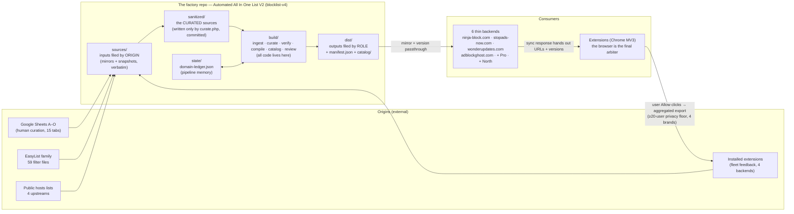
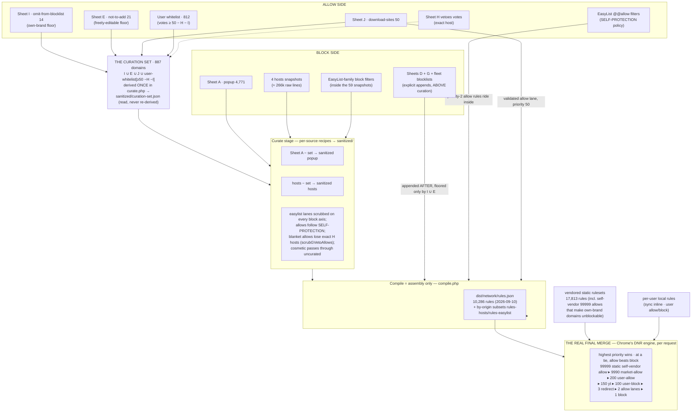
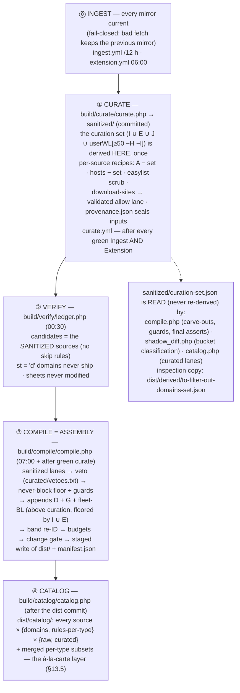
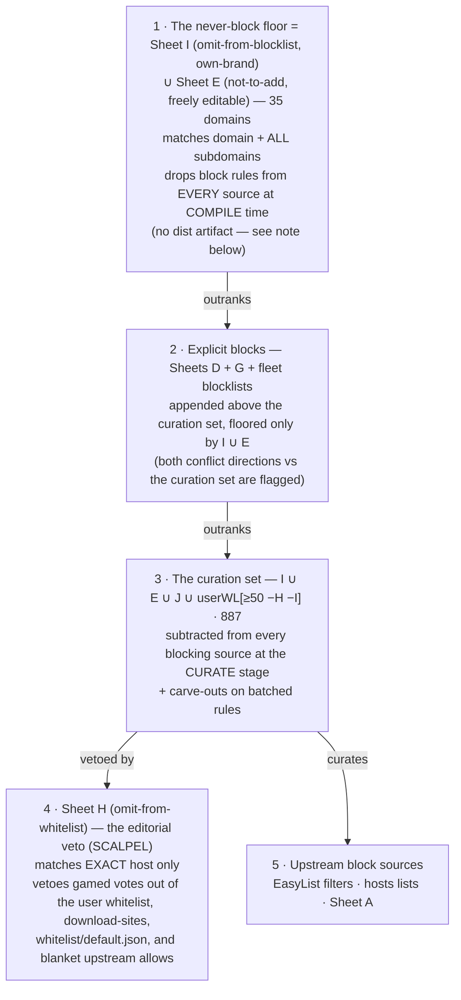
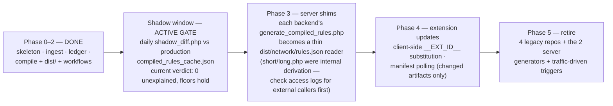

# The Blocklist / Whitelist System — "Automated All In One List V2"

> **Facts current as of 2026-09-18** (base text 2026-09-10 evening; the 2026-09-18 pass covers
> the twin builder §10.2, the default-list migration §17.1 and the new standalone artifact). Every number, path and threshold was verified
> against the factory repo at `~/Desktop/Dev/00 - Blocklist automation/Automated All In One
> List V2` (live at `github.com/meganerasam/blocklist-v4`, private) and the legacy backends.
>
> **State note:** the repo is live and the full CI chain is green. Since 2026-09-08 the data
> layer IS committed — sheet mirrors, snapshots, the `sanitized/` curated layer, the ledger and
> all of `dist/` ship as git commits (that is the distribution mechanism, §14). Data-derived
> counts below are from the 2026-09-10 run and drift a little every half-day; the always-true
> live values are in `dist/manifest.json` and `dist/catalog/catalog.json`.
>
> **Living sources** — check these first when this file and the repo disagree:
> `CLAUDE.md` (the non-negotiable rules + phase status), `STATUS.md` (per-file port map),
> `README.md` (tree contract), `sources/gsheet/SCHEMA.md` (sheet schemas), the
> **La fabrique des listes** visual map (French, one page — the fastest way in:
> <https://claude.ai/code/artifact/41284667-2753-42e1-900b-e33845579506>, local copy
> `~/Desktop/Dev/00 - Architecture/la-fabrique-des-listes.html`), and the
> **Ninja List Atlas** design-history artifact (sections 08–09):
> <https://claude.ai/code/artifact/6291c622-79d0-4fd5-b269-0ad6174ab0d1>
>
> ⚠ **Letters moved twice.** The sheet lettering was re-assigned on 2026-09-08 (download-sites
> inserted; old I–M → J–N) and again on 2026-09-10 (default-blocklist-not-to-add inserted at E;
> old E–N → F–O). Anything older than this document — the Atlas, old commit messages, the
> `*_vetoed_by_G/H` report keys — may use pre-move letters. This document uses the CURRENT
> letters everywhere and gives the sheet's real tab name alongside; when in doubt, trust the
> name, not the letter.

---

## 0 · How to read this document

| You are… | Read |
|---|---|
| **Anyone** — what this machine is and why it exists | Part I (plain language, one diagram, no jargon) |
| **An engineer** — exact mechanics: paths, formulas, guards, cadences | Parts II–V |
| **An AI agent / automation** — testable invariants and coupling edges | Part VII (plus the glossary, §18) |

Each section opens with a plain-language paragraph, then a diagram where one helps, then the
exact mechanics. Jargon is defined on first use and again in the glossary.

---

# Part I — The machine, in plain language

## 1 · What this machine does

Six ad-blocking browser extensions — **Ninja Block, Stop Ads Now, Ad Block Wonder, Ad Block
Ghost, Ad Block Pro, Ad Block North** — need to know, at all times, two things: *which domains
and URL patterns to block* (ads, trackers, scam popups) and *which to never touch* (banks,
login pages, the extensions' own infrastructure, sites users deliberately allowed). Those answers come from many places:
hand-curated Google Sheets, public filter lists like EasyList, public "hosts" blocklists, and
feedback from the fleet of installed extensions themselves.

**Automated All In One List V2** is the single factory that turns all of those raw inputs into
the finished, safe, size-checked rule files the extensions consume. It is one git repository
that fetches every input on a schedule, verifies that blocked domains still actually exist,
resolves every conflict between "block this" and "allow this" in one well-defined order, and
publishes one versioned output directory (`dist/`) that the extension backends mirror to
clients. It replaces four accumulated repositories (`blocklist`, `blocklist-v2`,
`blocklist-v3`, `whitelist-domains`) and two scripts that used to run on the production web
server (`generate_compiled_rules.php`, `generate_cosmetic_rules.php`).

The factory's two golden rules, in plain words:

- **Humans edit spreadsheets; machines edit everything else.** All normal curation happens in
  Google Sheets. The factory only *reads* them — it never writes a sheet, never "cleans up" a
  row, and when a fetched sheet looks wrong it keeps the previous copy and raises an alarm
  instead of publishing.
- **When in doubt, ship nothing new.** Every step is *fail-closed*: a suspicious download, a
  shrunken list, a rule count over budget — any of these stops the publish and leaves the last
  good output in place. A broken input can never silently reach a user's browser.

## 2 · The big picture



Left to right: external origins land in `sources/` exactly as fetched; `build/` code turns
them into role-based artifacts in `dist/`; the four extension backends mirror `dist/` and hand
versioned URLs to clients; the clients' own "Allow" decisions flow back in as the fleet
feedback loop — closing a loop that in the old system was collecting data **nobody read**.

## 3 · Why the old world had to be rebuilt

The previous system worked, but it had grown by accretion for years. The Ninja List Atlas
(surveyed 2026-09-07) measured it: **8 distinct data origins flowing through 4 GitHub repos
and 6 Actions workflows (2 of them dead) into traffic-driven server compilers**. The specific
problems, all verified in code:

**Eight scattered homes for a domain.** A domain could live in: Google Sheet A, the
`blocklist` repo (v1), `blocklist-v2`, `blocklist-v3`, hardcoded PHP arrays in the sync
endpoint (~1,480 domains inside `ninja-adb21.php`), vendored extension rulesets (17,813 rules
that no repo could rebuild), MySQL (user whitelists), and a second sheet (Sheet B). Finding
where a domain came from was archaeology. V2 reduces the places a domain can live to **three**:
the Sheets (mirrored), `curated/vetoes.txt`, and `sources/extension/`.

**Four repos as sediment, not layers.** Each repo was a *generation* that never retired its
predecessor: `blocklist` (v1, a sheet mirror) → `blocklist-v2` (a DNS-verification factory)
→ `blocklist-v3` (an EasyList-to-DNR compiler) → `whitelist-domains` (curated allow lists,
2 of its 3 files frozen since 2025-03). v2 even re-ingested v1's CSV as seed data. None of
them was a clean layer over the others; all four fed the server compilers in parallel.

**Traffic-driven server generators.** The production server had no cron. Its two compilers
fired *after a user sync response was flushed*, whenever the last successful build was older
than 24 h (with a 30-minute retry stamp and an `flock` guard). Rule generation was a side
effect of user traffic — an idle brand regenerated late; debugging required correlating user
requests with build logs.

**The last-50k truncation.** The long blocklist pipe had verified ≈ 423k live ad/tracker
domains, but `generate_compiled_rules.php:87` kept only `array_slice($longDomains, -50000)` —
the **last 50,000** — silently dropping ≈ 373k verified domains forever. Which domains
shipped depended on file ordering, not on any policy.

**A dead feedback loop.** User whitelists travelled client → MySQL → aggregated CSV export
(`user-whitelisted-domains.php`, ≥ 20-user floor) → pulled daily at 23:00 into
`blocklist-v3/whitelist/from-extension/` — where **no script read them**. The generator even
contained vestigial comments ("Inject whitelist placeholders into block rules") describing
code that had been amputated. Users voted; nobody counted.

**Propagation of 39–57 hours.** Worst-case chains from an edit to a user's browser, as
measured by the atlas:

| Pipe | Chain | Worst case |
|---|---|---|
| Short (Sheet A edit) | sheet → v1 mirror ≤ 12 h → server regen ≤ 24 h → client sync ≤ 3 h | **≈ 39 h** |
| Surgical (EasyList fix) | v3 compile ≤ 24 h → server regen ≤ 24 h → sync ≤ 3 h | **≈ 51 h** |
| Long (new tracker) | v2 run ≤ 24 h + 6 h → server regen ≤ 24 h → sync ≤ 3 h | **≈ 57 h** — *if* inside the last-50k window |

And because the compiled cache was versioned by a single md5 of the whole file, *any* change
anywhere re-shipped the entire 5.8 MB blob to every client. V2's targets (atlas §08): Sheet A
≈ 16 h, EasyList ≈ 27 h, tracker ≈ 34 h, and only the changed role artifact is re-downloaded.

## 4 · The one principle

> **Inputs are filed by origin, mirrored verbatim. Curation is its own layer, per source,
> inspectable. Outputs are filed by role. Feeds before merges.**

The directory name *is* the provenance — no archaeology needed. The tree contract
(from `README.md`, verified on disk):

```
sources/    ALL inputs, filed by origin, VERBATIM: gsheet/ (Sheets A–O) · easylist/ (59
            snapshots) · hosts/ (4 snapshots) · traffic_quality/ (Sheet B pre-split per
            market) · extension/ (fleet whitelists live · blocklists reserved)
sanitized/  the CURATED sources — machine-owned, written ONLY by build/curate/curate.php,
            committed so every curation decision is a git diff: the curation set, the user
            whitelist, the curated Sheet-A/hosts/easylist lanes, the download-sites allow lane
curated/    break-glass hand-edited files ONLY (vetoes.txt) — all normal human input = Sheets
state/      pipeline memory (domain-ledger.json, review/ reports) — machine-owned, never hand-edited
build/      ALL code (ingest / curate / verify / compile / catalog / review) — no code anywhere else
dist/       the public API — ONLY artifacts a consumer actually calls, plus two sanctioned
            exceptions: derived/ (inspection helpers) and catalog/ (the à-la-carte layer,
            §13.5); one manifest.json
```

Three corollaries, all enforced:

1. **No source URL anywhere except `sources/upstream.yml`.** Every sheet export URL, every
   hosts URL, every EasyList file — one reviewable file. This rule has been enforced by
   deletion twice: `generate_trackers_files.php` (removed 2026-09-07, carried a stale sheet
   URL) and the four legacy `build/verify/` chunk scripts (removed 2026-09-08; `update_domains.php`
   still hardcoded 10 upstream URLs). The one remaining standing exception is documented in §22.
2. **Only what is called is published.** As of 2026-09-08 the `dist/` contract was tightened:
   the factory publishes *only* artifacts a consumer actually fetches, plus a `derived/` folder
   of inspection helpers. Per-source "feeds" and intermediate rule stages that no one consumed
   were removed (§13). "Feeds before merges" survives as an *internal* discipline — each source
   is cleaned into its own lane before merging — but the lanes are no longer published.
3. **Sheets are human territory.** Machines read mirrors, never write sheets. Domain mirrors
   are flat string arrays with rows preserved exactly as entered — `www.x.com` and `x.com` are
   distinct entries and both are kept; no www-stripping, no "cleanup".

---

# Part II — The inputs

## 5 · The fifteen sheets (A–O)

All human curation lives in Google Sheets — fifteen of them, lettered A–O (re-lettered twice;
see the header warning). They fall into five roles: **rule sources** (A feeds the navigation
lane; D and G are appended blocks; C and J are allow sources), **vetoes** (E, H, I — a listed
domain *removes* things, and never produces a rule of its own), **data** (B, split per market
and published verbatim), **standalone** (K–O, mirrored and published as on-demand JSON but
never merged into any generated ruleset), and **parked** (F, mirrored with no recipe yet). The
fetcher (`build/ingest/fetch_sheets.php`) mirrors each sheet to a JSON file under
`sources/gsheet/` every 12 hours, behind a battery of fail-closed gates.

```mermaid
flowchart TB
    subgraph SHEETS["Google Sheets — human territory (machines never write)"]
        A["A · popup — 4,771<br/>navigation/scam destinations"]
        B["B · traffic-quality trackers<br/>market·hostname·nb_click"]
        C["C · default-whitelist — 178<br/>PRODUCT-ONLY"]
        D["D · default-blocklist — 2"]
        E["E · default-blocklist-not-to-add — 21<br/>VETO"]
        F["F · manual-whitelist — 0<br/>no recipe yet"]
        G["G · manual-blocklist — 0"]
        H["H · omit-from-whitelist — 34<br/>VETO, exact host"]
        I["I · omit-from-blocklist — 14<br/>VETO, never-block floor"]
        J["J · download-sites — 50<br/>dual role"]
        KO["K–O · standalone<br/>injection 344 · tracking-WL 46<br/>allow-req 19 · initiator 316 · rule101xtra 307"]
    end

    subgraph PIPE["Curate → compile lanes"]
        NAV["navigation lane (redirect rules)<br/>A + KADhosts, chunked PER SOURCE"]
        CURSET["the curation set (887)<br/>I ∪ E ∪ J ∪ user-whitelist[≥50 −H −I]<br/>subtracted from every blocking source"]
        APPEND["appended blocks<br/>D + G + fleet-BL — above curation"]
        FLOOR["never-block floor = I ∪ E (35)<br/>nothing may block these, ever<br/>— compile-time guarantee, no artifact"]
        DLLANE["download-sites allow lane<br/>50 allow rules, priority 50"]
        WLPROD["dist/whitelist/default.json (177)<br/>C − H − I, a served product"]
    end

    subgraph STANDALONE["Never merged"]
        TQ["dist/traffic_quality/<br/>24 market files, published verbatim"]
        SA["dist/standalone/<br/>Sheets K–O, on-demand JSON"]
    end

    A --> NAV
    B --> TQ
    C --> WLPROD
    I --> CURSET
    E --> CURSET
    J --> CURSET
    J --> DLLANE
    H -.->|"vetoes votes (exact host)"| CURSET
    D --> APPEND
    G --> APPEND
    I --> FLOOR
    E --> FLOOR
    KO --> SA
```



### 5.1 The contract table

| Sheet · tab name | Mirror | Rows | Contract |
|---|---|---|---|
| A · `popup` | `sources/gsheet/popup.json` | 4,771 | the navigation/scam-destination source (legacy pivot format kept). Curated − curation set → `sanitized/gsheet/popup.json` (4,486) → redirect rules, **chunked separately from KADhosts** since 2026-09-10 |
| B · `traffic-quality-trackers` | `sources/traffic_quality/*.json` (a directory) | 24 market files (incl. `global` + `latam`/`apac`/`nordics` rollups) | published untouched to `dist/traffic_quality/` — **never merged into rules** |
| C · `default-whitelist` | `sources/gsheet/default-whitelist.json` | 178 | **PRODUCT-ONLY** (decision 2026-09-08): ships as `dist/whitelist/default.json` (− H − I, 177) for backend sync; takes part in NO curation or scrub — its enforcement is entirely client-side; the C-vs-rules.json overlap is flagged every run |
| D · `default-blocklist` | `sources/gsheet/default-blocklist.json` | 2 | org default blocks, appended ABOVE curation — floored only by I ∪ E; **never DNS-verified**. Keep D and E disjoint (a domain in both cancels the append) |
| E · tab `blocklist_but_do_not_add` (factory name `default-blocklist-not-to-add`) | `sources/gsheet/default-blocklist-not-to-add.json` | 21 | **VETO** (new 2026-09-10): the freely-editable half of the never-block floor. A listed domain produces NO rule anywhere — curation-set member AND append floor. Holds the legacy Google ad-network set (doubleclick.net & co.) |
| F · `manual-whitelist` | `sources/gsheet/manual-whitelist.json` | 0 | mirrored; part of NO recipe (role to be decided) |
| G · `manual-blocklist` | `sources/gsheet/manual-blocklist.json` | 0 | appended blocks, exactly like D — **never DNS-verified** |
| H · `omit-from-whitelist` | `sources/gsheet/omit-from-whitelist.json` | 34 | **VETO, EXACT host only** — the anti-gamed-votes scalpel. Four consumers: user-whitelist step 2 · download-sites veto · the blanket-upstream-allow scrub (`scrubGVetoAllows`) · compile's subtraction before `whitelist/default.json` |
| I · `omit-from-blocklist` | `sources/gsheet/omit-from-blocklist.json` | 14 | **VETO, domain + ALL subdomains** — the own-brand never-block floor (tightest edit access of all sheets). Curation-set member + append floor + since 2026-09-09 also vetoed from every whitelist derivation exactly where H is. Ships no artifact (§11) |
| J · `download-sites` | `sources/gsheet/download-sites.json` | 50 | dual role (2026-09-08): ① curation-set member; ② allow SOURCE — rows normalized (strip protocol/path/port/www./trailing dot) − H − I → an ABP file → a validated DNR **allow lane** (priority 50 since 2026-09-11, was 2 — above blocks AND redirects, under the client user tier; 7 sub-resource types, websocket/other never dropped) |
| K · `whitelisted-domains-injection-enabled` | → `dist/standalone/` | 344 | standalone · on-demand JSON |
| L · `tracking-whitelist` | → `dist/standalone/` | 46 | standalone (was DNR rule 5005) |
| M · `allow-request-domains` | → `dist/standalone/` | 19 | standalone (was rule 5006) |
| N · `initiator-allowed-domains` | → `dist/standalone/` | 316 | standalone (was rule 5006) |
| O · `rule101xtra` | → `dist/standalone/` | 307 | standalone (was CSP-strip rule 33) |

Sheets K–O carry the arrays that used to be **hardcoded inside `ninja-adb21.php`** out of the
code and into curated, mirrored data. Sheets D/G are *deliberately* exempt from DNS
verification (owner decision): they are human declarations, shipped as entered.

### 5.2 Sheet formats and the mirror contract

Domain sheets (A, C–J, K–O) use a `domain | added | reason` layout — only the `domain` column
is required; `added`/`reason` are sheet-side audit trail and **never enter the mirror**.
Mirrors are flat, sorted, deduped JSON string arrays. Dedupe removes only *identical* rows —
the fetcher's comment is explicit: *"rows are kept EXACTLY as entered — www and bare domains
are distinct entries."*

Sheet A is special: it is still the legacy pivot ("Block List v3" column, quoted cells, a
blank-label pivot row, a `Grand Total` footer). The fetcher strips all the pivot furniture and
mirrors a flat domain array.

**Sheet B is split at ingest, not at compile.** Its layout is `market | hostname | nb_click`.
The fetcher groups rows by market and writes one flat, sorted hostname array per market
directly into `sources/traffic_quality/` — **24 files**: 20 country markets, `global.json`
(rows with an empty market, plus cross-market promotion of hostnames listed in ≥ 3 literal
markets), and the three regional rollups `latam`/`apac`/`nordics` (unions of member markets,
restored 2026-09-08 — v3's generator derived them and the backends' market maps request them).
A market that disappears from the sheet gets its file deleted. Two privacy-relevant details:
the `nb_click` column is validated in the header **then dropped** — click counts never leave
the sheet — and `dist/traffic_quality/` publishes these files byte-for-byte as-is.
Traffic-quality data is *data about trackers per market*, not blocking input: it is never
merged into rules. ⚠ Consumer trap (bit every brand swap): v3 named the baseline file
`general_global.json`; v4 names it `global.json` — keeping the old basename 404s the baseline
whitelist on every market, masked ~24 h by the per-market cache.

### 5.3 Ingest gates (per sheet, fail-closed)

Each sheet passes, in order (all in `fetch_sheets.php`):

| Gate | Detail |
|---|---|
| Fetch | 30 s timeout, UA `list-factory-ingest/1.0`; network error / empty body ⇒ fail |
| HTML/login detection | `<html` or `<!doctype` in the first 200 bytes ⇒ fail — *"sheet not link-viewable? wrong gid?"* (the `blocklist-prev.csv` failure mode, §6.3) |
| Header check | lowercased header row must begin with the expected columns (extra trailing columns like `added`/`reason` are ignored) |
| Row validation | rejects: `localhost`, no-dot strings, whitespace, IPs, purely-numeric hosts, invalid hostnames; non-ASCII is IDN→punycode'd via `idn_to_ascii` |
| Dedupe | exact-string only; duplicates reported |
| Shrink guard | Sheets **C, E, F, I, J**: *any* shrink vs the previous mirror ⇒ fail ("re-run with force to confirm") |
| ±30 % delta guard | Sheets **A, B only**, and only when the previous mirror has ≥ 20 rows |
| `TBD` skip | an `export_url` of `TBD` (or empty) in `upstream.yml` skips the sheet without failing the run |

A failed gate keeps the previous mirror byte-untouched, marks the row `❌ FAILED — kept
previous`, and turns the run red — while other sheets continue. Every run posts a per-sheet
diff summary (up to 20 added / 20 removed entries, rejects with sheet line numbers) to the
job's step summary. The escape hatch is the **confirming re-run**: dispatching the workflow
with `force: true` sets `INGEST_FORCE=1`, which bypasses the shrink and delta guards exactly
once.

## 6 · Upstream snapshots: hosts + EasyList

The bulk blocking power comes from public lists, but the factory never lets a live URL
anywhere near rule generation. `build/ingest/fetch_upstreams.php` mirrors every upstream into
`sources/` as a *snapshot*; verify and compile read **snapshots only**.

### 6.1 The four hosts lists — chosen by measurement

On 2026-09-07 every candidate hosts list was suffix-matched against the 129,955 domains the
EasyList pipe + bundled rulesets already blocked broadly. The verdict is recorded in
`upstream.yml` and the atlas:

| Upstream | Overlap with EasyList coverage | Decision |
|---|---|---|
| Firebog Easylist.txt | **99.6 % duplicate** | **dropped** |
| Firebog Admiral.txt | **92.4 %** (64 unique leftovers) | **dropped** |
| AdguardDNS | 44.1 % — **97,687 unique** | keep — the single biggest unique contributor (snapshot: 176,596 lines) |
| anudeepND | 71.3 % (~11.8k unique) | keep (42,541 lines) |
| Peter Lowe | 49.7 % (~1.6k unique) | keep (3,556 lines) |
| KADhosts | **1.0 % overlap** — 42.8k unique scam/fraud domains | keep, but **re-routed to the popup role** (scam redirect, not silent tracker block; 44,044 lines) |

The same measurement found **38.2 % of the DNS-verified long list already covered by
EasyList** — so the compile subtracts EasyList-covered domains from the hosts lanes before
building the tracker block rules (≈ 70k redundant entries never ship; see §10 step ④).

### 6.2 The 59 EasyList-family files

`easylist_snapshots:` in `upstream.yml` lists 59 filter files (easylist 15 · easylist_adult 7
· easyprivacy 22 · fanboy-addon 15) fetched from the EasyList GitHub tree into
`sources/easylist/<family>/<file>` (3.3 MB total). These feed the "surgical" pipe: the
per-category generators under `build/compile/{easylist,easyprivacy,fanboy,adult}/` parse ABP
filter syntax into DNR JSON (§10 step ③).

### 6.3 The snapshots doctrine — and the three scars behind it

Reading snapshots instead of live URLs buys two things for free: **last-good fallback** (a
failed fetch simply leaves yesterday's snapshot in place — downstream never notices) and
**daily diff history** (every snapshot change is a git commit; the repo's history *is* the
change log of every upstream). The doctrine exists because of three specific production scars:

1. **The HTML fossil.** v1's repo contained `blocklist-prev.csv` — a saved Google "can't open
   this file" HTML error page that had been fetched and committed as if it were data. Hence
   the HTML-detection gate on every fetcher.
2. **The week-frozen cache.** In July 2026 the server's regeneration guard touched its version
   file *before* attempting the build; combined with the 24 h TTL this froze the compiled
   cache from 07-16 to 07-23. Hence: **a version/success marker is written only after a
   verified successful build** (V2's manifest version is content-derived).
3. **The silent downgrade.** The old compiler once responded to a failed dnr.json fetch by
   writing a cache containing only the short/long rules — a silent fleet-wide downgrade. The
   fix ("keep the previous cache untouched, abort loudly") is now the universal fail-closed
   doctrine.

Gates in `fetch_upstreams.php`: HTML detection (same 200-byte sniff), min-size (20,000 bytes
for hosts, 50 for EasyList files), and a **±40 % size-delta gate** vs the previous snapshot
(applied only when the previous file is > 10 KB — tiny files legitimately swing hard). Each
file is independently fail-closed; any failure turns the run red. Note: `fetch_upstreams.php`
deliberately has **no force override** — an upstream that halves overnight stays held until a
human updates the snapshot or the upstream recovers.

## 7 · Fleet feedback: the loop that now closes

When a user clicks "Allow" on a site, that decision is recorded in the extension's backend
database. The old system exported these aggregates daily and then **read them nowhere**. V2
wires them into the curation set — the community becomes a first-class whitelist source, with
the Sheets as the human override.

**Two thresholds, and it is essential not to confuse them:**

- **≥ 20 users — the *export* contract.** Each backend's `user-whitelisted-domains.php` only
  emits a domain that ≥ 20 distinct users allowed (within a 6-month live-install window). This
  is a *privacy floor* on what may leave a server, not a statement of trust.
- **≥ 50 merged votes — the *trust bar*.** The factory only trusts a fleet domain once its
  vote count *summed across all four brands* reaches **50** (`COMMUNITY_MIN_VOTES = 50`,
  lowered from 200 on 2026-09-08 evening; defined in exactly ONE place,
  `build/curate/curate.php`). The ≥ 20 export floor is far too low to trust as an allow
  signal — 20 coerced clicks are trivially reachable — so the factory keeps its own bar. The
  user whitelist is then: votes ≥ 50 *(step 1)* − Sheet H `omit-from-whitelist`, exact host
  *(step 2)* − Sheet I `omit-from-blocklist`, domain + subdomains *(step 2b, symmetric-veto
  decision 2026-09-09)* → `sanitized/extension/user-whitelist.json`. On the 2026-09-10 run:
  1,479 exported domains → **812** trusted. It is both a curation-set member (§9) and a served
  product (`dist/whitelist/community.json`).

### 7.1 Mechanics

`build/ingest/fetch_extension_whitelists.php` (run by `extension.yml` daily at 06:00 UTC)
pulls each backend's export endpoint:

| id | Brand | Endpoint |
|---|---|---|
| 23 | Ad Block Wonder | `https://wonderupdates.com/user-whitelisted-domains.php` |
| 24 | Stop Ads Now | `https://stopads-now.com/user-whitelisted-domains.php` |
| 25 | Ninja Block | `https://ninja-block.com/user-whitelisted-domains.php` |
| 26 | Ad Block Ghost | `https://adblockghost.com/user-whitelisted-domains.php` |

- **Auth:** header `X-Whitelist-Token`, one shared token for all four backends. The GitHub
  Actions secret is named `USER_WHITELIST_DOMAINS`; each server holds the same value as
  `$whitelist_export_token` in its `config.php`. The fetcher refuses to follow redirects
  (a redirect could leak the token to another host). The endpoint is fail-closed too: any
  internal error returns an *empty* 500, never a 200 with a partial CSV.
- **Contract:** strict CSV — must start `domain,count\n`, every line
  `^[a-z0-9][a-z0-9.-]*,[1-9][0-9]*$`, ≤ 10 MB. A body that fails validation keeps the previous
  file. A header-only CSV is valid ("nothing clears the privacy floor" — currently true of
  extension-26/Ghost, 0 data rows).
- **Storage:** each response is stored **verbatim** as
  `sources/extension/whitelist/raw/extension-<id>.csv`. The merge then produces
  `raw/all-extension.csv` — union of domains with **user counts summed across brands**, sorted
  count-desc. It also still writes the flat `user-extension-whitelist.json` (the ≥ 20 export
  view, domains only), which the pipeline no longer *reads* — the user whitelist is built by
  `curate.php` from `all-extension.csv` counts with the ≥ 50 bar (the flat mirror survives as
  the raw cell of the catalog's `extension-whitelist` source). `all-extension.csv` is the
  fleet's single source of truth for both trust and review. Endpoint URLs live in
  `upstream.yml`'s `extension_endpoints:` block since 2026-09-10 — the fetcher reads them
  (rule 1 finally fully enforced; adding a brand is a one-line yml edit).
- **Run policy:** the workflow only goes red when **all four** endpoints fail; a partial
  failure keeps that brand's previous CSV and still publishes the rest.

**Blocklists are reserved with the identical contract:** `sources/extension/blocklist/` exists,
the compile already reads `sources/extension/blocklist/user-extension-blocklist.json` if
present (as an append source), and `upstream.yml` documents the planned
`?type=whitelist|blocklist` parameter. (The parameter is not yet implemented on either side.)

### 7.2 Fleet-vote semantics: the coercion funnel

The single most important editorial insight in the system, verified in the live data:

**The fleet whitelist wins by default.** `youtube.com` at **619,017 votes** is the mechanism
working exactly as designed — hundreds of thousands of users deliberately allowing a site they
want unbroken. Sheets C/E could never keep up with that signal.

**But votes on third-party ad infrastructure measure coercion, not intent.** Sites gate their
content behind "click Allow to continue" flows. When users comply, the *ad-infrastructure
domains* embedded in the page harvest the same "Allow" — so the vote counts on those domains
measure the coercion funnel's throughput, not anyone's wish to see them.
`oundhertobeconsist.org` at **5,879 votes — rank 3, above facebook** — is statistically
impossible organically: no human deliberately allows a gibberish domain. Its votes are the
echo of a funnel. The ≥ 50 trust bar filters the low-vote noise; it does *not* catch these
gamed high-voters — that is Sheet H's (`omit-from-whitelist`) job (§7.3).

**The triage rule: votes must be proportional to plausible deliberate human use.** A famous
site with huge votes → real. An obscure infrastructure domain outranking major sites → gamed.

### 7.3 The conflict report

`build/review/whitelist_conflicts.php` (rerun by `extension.yml` after every pull) frames the
disagreement correctly: the Sheet-A ∩ fleet-whitelist overlap is **a conflict report between
two authorities** — your popup curation vs the community's votes — not a poison list. Output:
`state/review/whitelist-conflicts.json`, on the 2026-09-10 run **1,479 rows · 382 flagged
`sheet_a_conflict` · 49 flagged `high_votes`** (its own reporting threshold `HIGH_VOTES = 500`,
independent of the ≥ 50 trust bar). Each row carries `domain · votes · whitelisted_via · in_sheet_a
· ledger status · flag`.

Per-domain resolution, quoting the file's own `how_to_use`: *"Sheet A was wrong → remove it
from Sheet A; or the votes are gamed → add the domain to `omit-from-whitelist` (today's Sheet
H). This file is regenerated — record decisions in the Sheets only."* Real examples:
`ojrq.net` (3,566 votes, affiliate-redirect infrastructure — a legitimate breakage fix, so the
fix is removing it from Sheet A) vs `effectivecpmnetwork.com` (an ad network — a gamed vote,
so the fix is adding it to Sheet H). The gamed high-voters (`oundhertobeconsist.org` 5,879,
`b7510.com` 4,659, `ojrq.net` 3,566) all clear the ≥ 50 trust bar; Sheet H remains their veto.

**Future work (decided, not built):** the export endpoints should exclude fraud-flagged
installs from the vote count (the ninja25 backend already has fraud tiers) — cleaning the
signal at the source. Related quirk: the fraud pipeline treats a non-empty `whitelistedDom` as
evidence of humanity, so bots *fabricate* whitelist entries — another reason raw vote counts
are not intent.

## 8 · `curated/vetoes.txt`: the pattern-level break-glass

One file in the repo is hand-edited outside the Sheets, on purpose. Its full current content:

```
# First-party-infrastructure veto — block rules whose urlFilter/regexFilter CONTAINS one of
# these patterns are dropped at compile time, whatever upstream says. Pattern = substring
# (host or host/path fragment), one per line. Break-glass file: stays in git on purpose.
# Origin: 2026-07 twimg incident (upstream blocked x.com's own app bundle).
abs.twimg.com
abs-0.twimg.com
twimg.com/responsive-web
```

**The incident:** between 2026-07-12 and 07-18, an EasyList upstream shipped a filter matching
`||abs.twimg.com/responsive-web/client-web/main.` — x.com's *own application bundle*. Every
user's x.com went blank until the upstream fixed it. The veto guarantees that class of rule can
never ship again, whatever upstream says.

**Why a git file and not a Sheet:** the Sheets speak *domains* (exact rows, subdomain semantics
defined per sheet). The veto speaks *substring patterns matched against rule text*
(`urlFilter`/`regexFilter` — note `twimg.com/responsive-web` is a host+path fragment, not a
domain). It is a different, sharper weapon: it drops individual *rules*, is consulted in the
final pass after every other decision, and changes to it deserve a git diff + review, not a
spreadsheet edit. Compile even fails if the file yields zero patterns.

---

# Part III — The build

## 9 · Convergence: how "block" and "allow" actually meet

There is a subtlety worth stating plainly: **there is no single merged list anywhere — the real
final merge happens inside Chrome**. The server-side compile only produces rule *populations*;
the browser's DNR engine (declarativeNetRequest) arbitrates every request by priority.
Understanding the system means tracking both merges: the build-time one you control, and the
runtime one Chrome performs.

In the **old world**, allow data edited the block side in exactly two ad-hoc places (the atlas's
"two cross-links"): blocklist-v2 subtracted the `whitelist-domains` files before DNS testing,
and blocklist-v3 scrubbed its converted DNR rules against `whitelistes3.txt`. Every other
whitelist travelled *separately* in the sync response and fought block rules at runtime through
DNR priorities. In **V2** (re-conception 2026-09-08 evening), one derived artifact — **the
curation set** — is built once, in ONE place (`build/curate/curate.php`), and subtracted from
every blocking source *before* verification or assembly. There is deliberately **no monolithic
exclusion pass anymore**: each source has its own curation recipe, applied at the curate stage,
and every removal is a visible git diff in the committed `sanitized/` tree.



The arbitration ladder mixes two provenances: the `redirect 3 · allow 2 · block 1` priorities
are set by this factory (verified in `compile.php` and the allow generators; compile asserts
min-allow-priority > max-block-priority over the whole merge) and the `99999` static
self-vendor allow is fixed by the vendored ruleset; the intermediate rungs (`9990`
market-allow, `200` user-allow, `150` YouTube fallback, `100` user-block) are set by the
backend/extension sync layer and are quoted from the atlas, not this repo.

Three things this diagram encodes. First, the compiled-in whitelists are the EasyList *allow*
filters (priority 2) plus the download-sites allow lane (priority 50 since 2026-09-11); every other allow authority acts
*before* the merge, through the curation set. Second, **Sheet C is in neither place**: since
2026-09-08 it is product-only — served to backends as `whitelist/default.json`, subtracting
nothing; its overlap with shipped rules is flagged every run (`default_whitelist_vs_shipped`),
with the redirect-INITIATOR axis called out separately because that is the one axis a
request-level client whitelist cannot counter. Third, the never-block floor (now **I ∪ E**) is
a **compile-time guarantee only**: it drops blocks everywhere (including from the appends,
which outrank the curation set) and is re-asserted over the whole merged array, but it ships
**no runtime artifact**, because own-brand domains are already unblockable in the browser via
the vendored static self-vendor allow rules at **priority 99999** (`defaultlist.json` ids
3654/3655, which outrank any local user block), and the rest of the floor is server-to-server
traffic the DNR engine never sees (see §11).

## 10 · The pipeline, in order: upstream → curate → verify → compile (→ catalog)

Everything about correctness lives in the order of operations. Since the 2026-09-08
re-conception the pipeline is FOUR stages plus an output layer, each its own script and
workflow; `compile.php` is *assembly only* — it makes no curation decision.



### 10.1 The curation set (derived at CURATE, read everywhere else)

```
curation set = Sheet I (omit-from-blocklist) ∪ Sheet E (not-to-add) ∪ Sheet J (download-sites)
             ∪ user whitelist[votes ≥ 50 − H(exact) − I(dom+sub)]
             — matched domain + ALL subdomains, 887 members on 2026-09-10
```

Derived **once**, in `build/curate/curate.php` only, published as
`sanitized/curation-set.json`; every consumer READS the file. An empty set is a fatal error
(broken mirrors), not an acceptable state. Its dual action on blocking sources: (a) block
rules/rows matching any member *or its subdomains* are removed at the curate stage — domains
out of `requestDomains`, emptied rules dropped, `||domain^` anchors dropped, wildcard-TLD
`||name.*` family members carved, generic-`main_frame` initiators stripped (the pornhub-class
hijack); (b) every *kept* batched block rule gets `excludedRequestDomains` carve-outs for set
members that are subdomains of a blocked parent — so blocking `example.com` survives while
`app.example.com` keeps working. Allow rules follow the **SELF-PROTECTION policy**: allows
anchored on / entirely targeting curated domains and initiator-scoped exceptions are KEPT
(they only ever protect the curated site); only MIXED `requestDomains` batches strip their
curated members. Separately, `scrubGVetoAllows` strips exact Sheet-H hosts from BLANKET
upstream allows only (a rule with no `urlFilter` and no `resourceTypes` un-blocks everything
on its axis); path/type-scoped exceptions are deliberately kept — they are why reCAPTCHA and
Google Docs still work. `curate.php` also writes `sanitized/provenance.json` (sha256 of every
input); compile refuses to assemble if any mirror moved since the last green curate.

### 10.2 The lanes (curated at ①, assembled at ③)

The easylist generators run *inside the curate stage* (into the gitignored
`build/compile/.work/`, wiped every run); their scrubbed outputs are committed under
`sanitized/easylist/`. Compile reads **only** `sanitized/`:

- **Navigation lane** (redirect role — historically "popup lane"): Sheet A and KADhosts,
  each already curated, dead-filtered by the ledger, floored — then **chunked PER SOURCE**
  (decision 2026-09-10: no A/KAD mixing before the merge; sheet-A 2,040 → 1 chunk, kadhosts
  39,872 → 8 chunks). Redirect rules: 5,000 domains per rule, priority 3,
  `regexFilter: '^http.+'`, `main_frame` only, target
  `chrome-extension://__EXT_ID__/pages/popup-tracker.html?url=\0`. Note the semantics: these
  are *scam/ad destinations a tab must never land on* — Sheet A is popunder-adtech, KADhosts
  is Polish anti-fraud; different natures, same correct treatment.
- **Domains lane** (broad tracker blocking): AdguardDNS + anudeep + Peter Lowe (sanitized),
  minus ledger-dead, plus policy-retention re-adds, **minus what EasyList already blocks
  broadly** (the 38.2 % finding, §6.1) → per 5,000-chunk, one block rule (priority 1, resource
  types `script·xmlhttprequest·sub_frame·image·media`) *plus* one main-frame redirect twin.
- **Surgical lane**: the curated easylist DNR lanes (block priority 1, allow priority 2,
  cosmetic passed through uncurated) plus the **download-sites allow lane** (50 rules,
  priority 2, exactly the 7 mapped sub-resource types — compile re-validates every rule on
  load). The merged feed is vetoed (`curated/vetoes.txt`) and re-ID'd; main-frame-only
  domain blocks get redirect twins — but **only when the source is a bare domain block**
  (no `urlFilter`, no `domainType`), tightened 2026-09-18 (commit `057674e`).

  **Why the rule is that strict.** The twin is always `regexFilter ^http.+` — a
  `regexSubstitution` redirect needs a `regexFilter` — so it structurally *cannot* carry the
  source rule's `urlFilter` or `domainType`. Building one from a scoped source therefore
  widens it into a blanket main-frame redirect of everything in that scope. The 2026-09-08
  pass stripped curation-covered initiators and skipped a twin left with no scope, which was
  correct but incomplete: it framed the problem as a whitelist problem when the widening
  happened regardless of any whitelist. A scoped source now keeps its block rule and loses
  only the blocked-page landing. **Under-redirecting is the only safe direction on this axis**,
  because a wrong twin hijacks navigation that no client-side whitelist can counter.

  Measured effect: redirect twins **63 → 48**, hijacked initiators **85 → 19** (66 sites
  freed). Worst offender was `|about:` scoped to 51 initiators — every navigation from
  `dood.*`, `streamtape.*`, `uptostream.*`, `popads.net`, `imagetwist.com` … landed on the
  blocked page. Also gone: `||hltv.org^*=|` → all of hltv.org, `|http*://*?` →
  pornhub/redtube/tube8/youporn/socialmediagirls, `||facebook.com/ads/ig_redirect/` → all of
  instagram.com, `||rentalcars.com/?affiliateCode=` → all of seatguru.com. All 13 surviving
  initiator-scoped twins carry **both** `initiatorDomains` and `requestDomains`, so they fire
  only on navigation from X to a specific blocked destination. Skipped twins are listed in
  `state/review/compile-drops.json` → `twin_scoped_source_skipped`, with the source pattern
  and the scope that would have been widened.

### 10.3 Appends — above the curation set, floored only by I ∪ E

Sheets D + G + fleet blocklists are **deliberate human/org blocks**: they are appended after
everything else and the curation set never scrubs them. Only the never-block floor (I ∪ E)
still drops them, and only the floor carves their chunks. Overlaps with the curation set
are **flagged, never silently resolved — in both directions**:

- `append_vs_whitelist_conflicts`: an append domain that is itself in the curation set.
- `append_parent_overrides`: a whitelisted domain living *under* an append domain (because
  `requestDomains` matches subdomains and appends carve only against the never-block floor, so
  the append blocks the whitelisted child).

Both lists go to `state/review/compile-drops.json`; the explicit block wins in each case, but
the tension stays visible. Historical note: the early conflict catches (`ad.doubleclick.net`,
`ads.youtube.com`) were resolved on 2026-09-10 by moving the whole legacy Google-ad-network
set from Sheet D to the new Sheet E — the floor now guarantees those domains produce no rule
at all. Sheet D holds 2 domains today, and **D and E must stay disjoint**: a domain in both
cancels the append entirely (E outranks D), which briefly killed the append lane before
788c6b1 fixed it.

### 10.4 Merge, budgets, gates

- **ID bands** (inherited from production so client assumptions survive): redirect 11000–20999 ·
  block 21000–30999 · modifyHeaders 31000–40999 · allow 41000–50999 · allowAllRequests
  51000–90999 · unknown 91000+. IDs < 11000 stay reserved for the server's inline sync rules.
  Band overflow is a fatal error, not a wrap. **Watch item:** the block band sits around
  30,100 / 31,000 — under 1,000 IDs of headroom before it would collide with the
  modifyHeaders band.
- **By-origin subsets** (2026-09-10, user request): alongside `rules.json`, compile publishes
  `network/rules-hosts.json` (the 4 hosts feeds: tracker chunks + twins + the KADhosts
  navigation chunks — 60 rules) and `network/rules-easylist.json` (the surgical lanes incl.
  their twins — 10,174). Both keep the **canonical IDs**, so every rule cross-references the
  merge; an origin tag is carried through assembly and stripped at emission.
- **Provenance stamp** (2026-09-10, adversarial review): `manifest.json` carries
  `sanitized_provenance` — the sha256 of `sanitized/provenance.json` at compile time. The
  catalog refuses to run when it mismatches, closing the reproduced hole where a green curate
  plus a gated compile left `dist/` one generation behind `sanitized/`.
- **Final-pass asserts over the whole merged array:** no surviving block/redirect rule may cover
  an H domain (never-block violation ⇒ abort) and no block rule may contain a vetoed pattern. The
  floor and the veto are checked *again* after everything else has run.
- **DNR budgets** (rule 8 of CLAUDE.md): total ≤ **30,000** rules (Chrome's dynamic-rule cap),
  redirect+modifyHeaders ≤ **5,000** ("unsafe" cap), regex rules ≤ **1,000**. The total and
  unsafe budgets are asserted twice — inside `compile.php` and again independently in
  `compile.yml` via `jq` on the manifest (the regex cap lives in `compile.php` only) — plus a
  `grep` asserting the `__EXT_ID__` placeholder survives (substitution moves **client-side** in
  V2; the compiled artifact must stay extension-agnostic so all four brands share one `dist/`).
- **Change-budget gate:** vs the previous manifest, a rule-count move > 30 % or a shipped-domain
  drop > 20 % holds the publish (fatal) unless `COMPILE_FORCE=1`. This automates the twimg-class
  defense: an upstream poisoning can never ship on autopilot.
- **Staged writes + pruning:** every artifact is computed and every assertion passes **before the
  first byte lands in `dist/`**; then everything is written via tmp+rename. After writing, the
  managed `dist/` dirs are pruned — any file not staged this run (a delisted market, a retired
  artifact) is deleted, so `dist/` can never accrete stale outputs (`static-rulesets/` is the one
  unmanaged, reserved slot). A failed run leaves the previous `dist/` byte-identical.
- **Review artifact:** `state/review/compile-drops.json` — the full drop/conflict lists
  (Sheet-A domains dead per ledger · popup-lane domains excluded by whitelist · both append
  conflict directions). Timestamp-free on purpose, so unchanged content never churns a commit.

2026-09-10 run: **10,286 rules** (block 9,103 · allow 1,127 · redirect 56), ≈ 170.5k shipped
block domains (still converging down as the verify backlog drains), compile ≈ 1 s.

## 11 · The precedence ladder — and the H/I asymmetry

Who beats whom, from the floor up:



**The asymmetry is deliberate and load-bearing:**

- **Sheet H (`omit-from-whitelist`) matches the exact host only.** H exists to remove *gamed*
  fleet votes from the whitelists (§7.3) — it currently vetoes hosts like `google.com`,
  `search.yahoo.com`, `gemini.google.com`, `chromewebstore.google.com`. If H matched
  subdomains, `google.com` in H would also strip `accounts.google.com` from every whitelist,
  breaking Google login for the entire fleet. H is a **scalpel**: it must cut exactly one host
  per line, never a family. Since 2026-09-09 it has a second, opposite-polarity job:
  `scrubGVetoAllows` removes exact H hosts from *blanket* upstream allow rules (a rule with no
  `urlFilter` and no `resourceTypes` un-blocks everything on its axis); path/type-scoped
  exceptions are kept, and `gVetoAllowLeaks` fails the build if a blanket allow survives.
- **Sheet I (`omit-from-blocklist`) matches the domain plus all subdomains.** I holds the 14
  domains the extensions themselves depend on (`ninja-block.com`, `adblockghost.com`,
  `wonderupdates.com`, `stopads-now.com`, …). If any of these — or *any future subdomain* —
  got blocked, the product would break. I is a **shield**: it must cover territory, including
  hosts that don't exist yet. It has the tightest edit access of all sheets (own-brand only) —
  which is exactly why **Sheet E** exists as the *freely-editable* half of the same floor
  (same matching, same guarantees; today it holds the legacy Google ad-network set).
- **Symmetric veto (decision 2026-09-09):** I is ALSO subtracted everywhere H is (user
  whitelist step 2b, download-sites, `whitelist/default.json`) — each with its own matcher.
  Standing guarantee: no vote count can whitelist an own-brand domain and switch the extension
  off on our own pages.
- **The floor (I ∪ E) overrides every block source** — upstream lists, the org's own Sheets
  D/G, fleet blocklists — but **at compile time only.**

**Why the floor ships no runtime artifact (decision 2026-09-08, verified).** Earlier designs
shipped `dist/network/never-block.json` so the client could refuse *local user block rules* on
floor domains. That artifact was removed after verifying it was redundant:

- Own-brand domains are already unblockable in the browser. The vendored static ruleset
  `defaultlist.json` carries self-vendor **allow** rules at **priority 99999** (ids 3654/3655)
  which outrank any local user block a user could create — so the extension cannot block its
  own update/telemetry host regardless of the ledger or a user's actions.
- The remaining floor entries (`secured-pixel.com`, `secure-check.co`, …) are
  **server-to-server** traffic that the DNR engine never sees, so a client-side never-block
  list would protect nothing.

The floor therefore remains a real, asserted compile-time guarantee (it drops blocks — the
appends included — and is re-checked over the whole merge; note the floor domains still appear
in `rules.json` as `excludedRequestDomains` carve-outs and allow entries — that is the floor
*working*, not a leak). In code: H is applied by exact-key `unset`; the floor and the curation
set use an equal-or-subdomain suffix walk everywhere — `covered_subdomain()` in the ledger,
its twin `isWhitelistCovered()` in curate/compile, the final-pass asserts, and the shadow diff.

## 12 · The domain ledger: verification as memory, not ritual

The old system re-tested **all 183k working domains every day** in a 30-chunk CI matrix
(~6 hours), while separately hoarding an 863,246-line dead-domain graveyard that nothing
consumed. V2 replaces the ritual with memory: one record per domain in
`state/domain-ledger.json` (machine-owned), tested on a schedule proportional to how interesting
the domain is.

```mermaid
stateDiagram-v2
    [*] --> new : first seen in a snapshot / Sheet A
    new --> active : DNS ok (A / AAAA / CNAME)
    new --> dead : DNS fail (f=1 → retry in 1 d)
    active --> active : weekly recheck ok (nc = +7 d)
    active --> dead : fail (died — f=1, retry 1 d)
    dead --> dead : still dead — backoff 1 d / 7 d / 30 d / then quarterly
    dead --> active : resolves again (resurrected — f=0)
    dead --> [*] : purged — dead AND delisted > 180 d (or delisted > 365 d)
    active --> [*] : purged — delisted > 365 d
    new --> [*] : purged — delisted > 365 d
    note right of dead : "delisted" is not a status —\nit is derived from ll ≠ today\n(no longer listed by any source);\ndelisted domains are never tested,\nonly aged out
```



### 12.1 Record schema (exact)

One JSON object per domain, short keys (`ledger.php`):

| Key | Meaning | Values |
|---|---|---|
| `s` | sources listing it | array of `anudeep` · `peterlowe` · `adguarddns` · `kadhosts` · `sheet-a` |
| `fs` | first seen | `Y-m-d` (UTC) |
| `ll` | last listed in a snapshot / Sheet A | `Y-m-d` |
| `lo` | last DNS ok | `Y-m-d` or `null` |
| `f` | consecutive fails | int (0 when alive; seeded-dead start at 3) |
| `nc` | next check | `Y-m-d` |
| `st` | status | `n` new · `a` active · `d` dead |

Seeded population (2026-09-07): **266,451 records — 141,303 active · 72,212 dead · 52,936
never-tested backlog**. As of 2026-09-10: **270,142 records (≈ 95k active · 27k dead · 148k
backlog, draining at `MAX_TESTS = 60,000` per nightly run)** — the shipped set keeps
converging down as the backlog drains. The file is committed (`state/domain-ledger.json`,
~33 MB), written only by `ledger.php`.

### 12.2 Scope — the sanitized candidates, no skip rules

**Candidates = the SANITIZED sources: `sanitized/hosts/*.txt` + `sanitized/gsheet/popup.json`.
Nothing else.** Sheets D and G are **never DNS-verified** (owner decision — human
declarations ship as entered). Since the curation stage (2026-09-08 evening) ALL the ledger's
old skip rules are deleted: curate already subtracted the curation set before the ledger ever
sees a candidate, so the ledger tests *exactly what can ship* — no more re-derived exclusion
logic, no more floor checks. Curated-out domains simply stop being listed (`ll` ages) and fall
to the retention purge. Per record only two checks remain: **delisted → never tested** (`ll ≠
today`), and **not due yet** (`nc > today`).

### 12.3 Scheduling, caps, retention

- Test plan: Sheet-A domains first, then most-overdue first; capped by `MAX_TESTS` (default
  **60,000**; workflow input) with `WORKERS` parallel forks (`pcntl`; `ledger.php` default 16,
  `verify.yml` sets 24). DNS check = `checkdnsrr` A, then AAAA, then CNAME on the FQDN.
- **Tiers:** alive → recheck in 7 d. Fail backoff: 1 d → 7 d → 30 d → quarterly (90 d).
- **Retention:** purge when dead + delisted > **180 d**, or delisted > **365 d** whatever the
  status. A purged domain that reappears costs exactly one test as `new`. This *policy retention*
  is what replaced the arbitrary last-50k slice: a domain ships while it still resolves and its
  listing is still remembered — bounded at 12 months, decided by policy, not file position.
- **Sheet A is report-only:** the compile drops `st='d'` domains from what ships, but the sheet
  itself is never modified; dead entries surface in run summaries.
- **~6× less DNS work:** the legacy ritual burned ~184k DNS tests *every day*. Steady-state V2
  burns ~141k active / 7 d ≈ 20k + dead-backoff trickle + new arrivals ≈ **~25–30k/day**, with
  *better* freshness on the domains that matter (new tested same day, actives weekly).

### 12.4 Seed strategy: trusted same-day knowledge, no graveyard

The ledger was seeded from legacy v2's **same-morning** run: snapshot-listed domains found in
v2's `working_domains` were seeded `active` (with randomized 1–7 d next checks to spread the
weekly load); those in v2's `inactive` were seeded `dead` at `f=3` (30-day backoff); everything
else `new`. The **863k-line dead-domain graveyard was deliberately not imported** — dead
knowledge older than same-day trust is cheaper to rediscover (one test each, on backoff) than to
carry forever.

> **Cold-start note.** Because the initial commit ships no data, a fresh clone has no ledger.
> The first `ledger.php` run **self-seeds**: every candidate starts `new` and the backlog drains
> across daily runs under `MAX_TESTS`. Until it drains, compile ships not-yet-tested domains
> (innocent until proven dead), so the shipped set shrinks over the first few days. The
> 141k-trusted-active head start only exists if v2's working/inactive seed files are supplied via
> the `SEED_WORKING`/`SEED_INACTIVE` env vars; otherwise the head start is re-earned by testing.

---

# Part IV — The outputs

## 13 · `dist/` — the only consumer API

Nothing outside the repo may consume anything except `dist/` (and, during migration, the shims
that proxy it). The contract is **only what a consumer actually calls, plus two sanctioned
exceptions**: `derived/` (inspection helpers) and `catalog/` (the à-la-carte layer, §13.5 —
the one deliberate reversal of the "no unconsumed copies" doctrine, user decision 2026-09-10).
Everything is inventoried in **one** `manifest.json` with a content-derived version (the
catalog has its own index, `catalog/catalog.json`).

Current contract (counts from the 2026-09-10 run; live values in the manifests):

| Artifact | Role / notes |
|---|---|
| `manifest.json` | schema 1 · content-derived sha256 version · per-artifact `sha256/bytes/count` · counts + budgets · `sanitized_provenance` (ties dist to its sanitized generation) |
| `network/rules.json` | **THE** merged DNR ruleset the extensions load (10,286 rules) |
| `network/rules-hosts.json` · `rules-easylist.json` | by-origin subsets of the merge (60 · 10,174) — canonical IDs kept, cross-referenceable |
| `whitelist/default.json` | Sheet C − H − I (177) — the org default whitelist, backend sync |
| `whitelist/community.json` | the user whitelist (votes ≥ 50 − H − I, 812) — byte-identical to `derived/community.json`, staged twice on purpose (derived/ = inspection, whitelist/ = product) |
| `whitelist/download-sites.json` | the normalized + vetoed download sites (50) — harvested from the validated allow lane, never the raw sheet (whose `www.` rows would not match) |
| `blocklist/popup.json` | Sheet A's own SHIPPED contribution (2,040) — strict subset of the next |
| `blocklist/popup-curated.json` | the navigation lane as a flat array (41,909): A ∪ KADhosts − ledger-dead − floor − curation set; staged from the same sets the redirect rules are chunked from, so file and rules.json cannot diverge |
| `cosmetic/generic.css` | merged generic element-hiding selectors (14,430) |
| `cosmetic/specific.json` | per-domain hide selectors (8,433 domains) |
| `cosmetic/extended.json` | `:has-text` / css-injection rules (317) |
| `cosmetic/unhide.json` | `#@#` exception selectors (530) |
| `standalone/*.json` | Sheets K–O, published verbatim as on-demand JSON (5 files) |
| `traffic_quality/*.json` | Sheet B, byte-verbatim from `sources/` (24 market files incl. rollups) |
| `derived/to-filter-out-domains-set.json` | the curation set, inspection copy (887) — **renamed from `curation-set.json` 2026-09-10** (the dist name says what it is for a consumer; `sanitized/curation-set.json` keeps the internal name) |
| `derived/community.json` | inspection twin of `whitelist/community.json` |
| `catalog/**` | the à-la-carte layer — see §13.5 |
| `static-rulesets/` | *empty, reserved* — the vendored 17,813-rule bundles still have no generator; rebuild-or-keep-vendored is the last open compile-adjacent decision (deliberately **not** pruned) |

**Killed artifacts** (must not silently reappear): `feeds/` (unconsumed source copies — note
`catalog/raw/` deliberately supersedes this decision as a *consumer-facing, indexed, pruned*
surface), `network/{popup,domains,filters}.json` (derivation stages),
`network/never-block.json` (§11), `whitelist/manual.json` (Sheet F is in no recipe), `popup/`
(each backend's `short.php`/`long.php` were internal derivation — resurrect a flat popup file
only if access logs ever show external callers). `whitelist/community.json` was killed then
**resurrected 2026-09-09** at the user's request.

Key output properties:

- **Content-derived versioning.** `manifest.version` = sha256 over the per-artifact sha256 map:
  identical inputs ⇒ identical manifest, byte-deterministic. `generated_at` is carried over
  unchanged when content didn't move, so no-op runs produce no diff.
- **`__EXT_ID__` stays a placeholder.** The legacy server substituted the extension ID at serve
  time; V2 ships the placeholder and each client/shim substitutes its own — one `dist/` serves
  all brands. Asserted by grep in CI.
- **Zero generated rules on curation-set domains.** The curate-stage recipes + carve-outs
  guarantee no EasyList/hosts-derived block rule covers a curation-set domain. The one
  deliberate exception: explicit appends (D/G/fleet-BL) win over the curation set — flagged
  both directions (§10.3) — and only the never-block floor outranks them.
- **Budgets in the manifest.** Consumers can verify `counts` vs `budgets` themselves; CI does.

### 13.5 `dist/catalog/` — the à-la-carte layer (2026-09-10)

The user's mental model, built into an output layer: a **3-axis matrix** — *source* (each
sheet, each public list, the fleet — or all combined) × *representation* (`domains.json` vs
DNR rules split **per action type**) × *stage* (`raw/` → `curated/` → `merged/`, mirroring the
pipeline's own sources → sanitized → dist). Emitted by `build/catalog/catalog.php` after every
green compile; 117 files ≈ 71 MB; indexed by `catalog/catalog.json` (role, matching, per-cell
counts and notes, per-artifact sha256, content-derived version).

- **`raw/<source>/`** — the source verbatim, BEFORE any subtraction. Inspection/composition
  only, **never shippable as-is**: it predates the floors, the vetoes and the curation set.
- **`curated/<source>/`** — after the source's own recipe (copies/reshapes of `sanitized/` +
  `dist/`; the only computation is the appends' floor subtraction). Each rules file carries
  IDs 1..N and loads as a standalone DNR ruleset (Chrome scopes ID uniqueness per ruleset);
  concatenating catalog files into ONE ruleset requires re-IDing — which is what the canonical
  merge already does.
- **`merged/`** — the cumulés: `rules/{block,redirect,allow}.json` (subsets of the canonical
  merge, **canonical band IDs kept**) and `domains/{block,redirect,allow,cosmetic}.json`
  (per-type rollups). The canonical merge itself stays `network/rules.json` — never
  duplicated, never re-compiled.

Source ids: `gsheet-<tab-name>` (14) · `easylist-{easylist,easyprivacy,fanboy,adult}` ·
`hosts-{adguarddns,anudeep,peterlowe,kadhosts}` · `extension-{whitelist,blocklist}` ·
`gsheet-traffic-quality` (index-only). Absent cells are information, not omissions: veto
sheets (E/H/I) produce no rules by definition, download-sites has no raw rules (the row
normalization IS the curate recipe), the unhide map exists for all four easylist lists while
the full cosmetic set (generic.css/specific/extended) exists only for easylist and fanboy, and
cosmetic is identical raw↔curated (never curated). Hardened the same day by a 7-agent
adversarial review (4 majors
confirmed by reproduction, all fixed): pure-`||domain^`-anchor-only domain extraction
(over-coverage would have listed `googleapis.com` as sitewide-blockable from a path rule), the
`sanitized_provenance` cross-stage gate, publish decoupling (a catalog-only failure turns the
run red but never withholds the fleet-serving dist commit), and an accepted-for-now repo-growth
trade-off (~21 MB gz per full churn).

## 14 · The distribution decision

**Decided 2026-09-07: `dist/` is published as git commits, and the fleet fetches it through the
backend mirrors — never from GitHub directly.** Live since 2026-09-08 as the private repo
`github.com/meganerasam/blocklist-v4` (secret set, full CI chain proven green unattended).

Why this shape:

- **The repo must stay private** — `all-extension.csv` carries per-domain user counts and
  `sources/traffic_quality/` carries per-market tracker intelligence; neither may be public.
  Private repo ⇒ no public raw URLs ⇒ clients can't fetch GitHub directly anyway.
- **Zero extension changes.** The sync response *already* hands every client its rule URLs +
  versions (`ninja_rules_url`, `ninja_css_url`, `ninja_specific_url` fields in
  `ninja-adb21.php`). Backends mirroring `dist/` and bumping versions is invisible to clients —
  repointing the fleet is a server-side edit.
- **Commits keep the daily-diff history** (§6.3) — git history is the audit trail of every
  published artifact. (Note: the *generated-data* inputs are intentionally *not* committed —
  the initial commit is code + contracts only; `dist/` is what carries the published history.)

**Fallback + considered alternatives** (atlas pre-flight #4): raw.githubusercontent.com is
documented as a *fallback* mirror source for the backends only — never a client-facing origin
(that would require a public repo or token distribution and give up the backends'
control/analytics point). Release assets or GitHub Pages were also considered (stable URLs, no
history bloat — but they lose the commit-diff history).

---

# Part V — Operations

## 15 · The daily cadence

Five GitHub Actions workflows, deliberately chained so each feeds the next
(Ingest/Extension → Curate → Compile → Catalog):

```mermaid
gantt
    title One UTC day in the factory (clients current within their next 3 h sync after a publish)
    dateFormat HH:mm
    axisFormat %H:%M
    section ingest.yml
    Mirrors + snapshots (run 1)      :i1, 00:00, 25m
    Mirrors + snapshots (run 2)      :i2, 12:00, 25m
    section verify.yml
    Ledger DNS pass (≤60k tests)     :v1, 00:30, 150m
    section extension.yml
    Fleet pull + conflicts review    :e1, 06:00, 10m
    section curate.yml
    Curate after green 00·00 ingest  :u0, 00:30, 10m
    Curate after fleet pull          :u1, 06:15, 10m
    Curate after green 12·00 ingest  :u2, 12:30, 10m
    section compile.yml
    Compile+catalog after each green curate :c0, 00:45, 15m
    Daily compile+catalog → dist/    :c1, 07:00, 15m
    section fleet
    Backends mirror + clients sync ≤3h :f1, 07:15, 180m
```



| Workflow | Trigger | What it does | Red when |
|---|---|---|---|
| `ingest.yml` | cron `0 */12 * * *` + dispatch (`force`) | `fetch_sheets.php` + `fetch_upstreams.php`; commits every successful mirror **even when another sheet fails** | any sheet/upstream gate rejected (previous mirror kept) |
| `extension.yml` | cron `0 6 * * *` + dispatch | `fetch_extension_whitelists.php` + `whitelist_conflicts.php`; commits `sources/extension/ state/review/` | **all four** endpoints failed |
| `curate.yml` | `workflow_run` after **every green** Ingest AND Extension + dispatch | `curate.php`; commits `sanitized/ state/review/` — never curates from a red refresh | any recipe/gate failure (previous `sanitized/` kept) |
| `verify.yml` | cron `30 0 * * *` + dispatch (`max_tests`) | `ledger.php` with `MAX_TESTS=60000`, `WORKERS=24`; commits `state/` | script failure (DNS fails never redden a run) |
| `compile.yml` | cron `0 7 * * *` + `workflow_run` after **every green** Curate + dispatch (`force`) | `compile.php` → jq budget asserts + `__EXT_ID__` grep → **Commit dist** → `catalog.php` → **Commit catalog** (order matters: a catalog-only failure turns the run red but never withholds the fleet-serving dist commit) | any gate/assert (previous `dist/` kept) |

The ordering is intentional: verify runs after the midnight snapshot refresh; the fleet pull
lands at 06:00 so the day's curation is built from same-morning votes; and the `workflow_run`
chain fires curate after every green refresh and compile after every green curate — a sheet
edit ships the same half-day. ⚠ The workflow `name:` strings are FROZEN: `curate.yml` matches
Ingest/Extension by their literal names, and `compile.yml` matches "Curate — sanitize
sources"; renaming any of them silently breaks the chain.

## 16 · Fail-closed, everywhere: the gate inventory

The doctrine in one sentence: **a failed or suspicious input keeps the previous artifact and
turns the run red — the system never publishes from a partial input.** Per component:

| Component | Gates | Force override |
|---|---|---|
| `fetch_sheets.php` | HTML/login sniff (first 200 B) · header prefix match · row-level domain validation · shrink guard (C/E/F/I/J) · ±30 % delta (A/B, prev ≥ 20 rows) · TBD skip | `INGEST_FORCE=1` (dispatch input `force`) bypasses shrink+delta only |
| `fetch_upstreams.php` | HTML sniff · min-size (hosts 20,000 B · easylist 50 B) · ±40 % delta (prev > 10 KB) | **none — deliberately** |
| `fetch_extension_whitelists.php` | strict CSV contract · ≤ 10 MB · no redirects · missing token = per-endpoint failure | none; red only if all 4 fail |
| `ledger.php` | fatal only when zero candidates load; corrupt/empty existing ledger = FATAL (never a silent reseed); DNS failures are data, not errors | `MAX_TESTS` dispatch input |
| `curate.php` | missing/invalid mirror fatal (E and J fail-SOFT to empty+warn — the documented bootstrap path) · empty user whitelist after vetoes fatal · generator non-zero fatal · `.work/` wiped pre-run · download-sites template guards (`$document`/`$~third-party`/non-`@@` = fail) · `gVetoAllowLeaks` (a surviving blanket allow on an H host = fail) · staged writes + prune of `sanitized/` · `provenance.json` seals every input | none |
| `compile.php` | provenance gate (any mirror moved since the last green curate = fatal — no mixed-generation publish) · missing/invalid mirror or sanitized lane fatal · download-sites lane re-validated rule-by-rule · never-block floor + veto + anchor-axis + redirect-initiator final-pass asserts over the WHOLE merge · min-allow-prio > max-block-prio · ID-band overflow · DNR budgets · change gate (>30 % rules / >20 % domain drop) — all **before** any `dist/` write; then managed-dir prune | `COMPILE_FORCE=1` bypasses the change gate only |
| `catalog.php` | provenance gate (same as compile) · manifest↔rules.json sha coherence · `manifest.sanitized_provenance` match (dist must come from the CURRENT sanitized generation) · merged split losslessness · curated-lane floor asserts · staged writes + own prune of `dist/catalog/` · byte-deterministic | none |
| `compile.yml` | independent jq re-assert of total+unsafe budgets + `__EXT_ID__` grep · refuses to run after a red curate · Commit dist BEFORE the catalog step (catalog failure never withholds the canonical publish) | dispatch `force` |
| `shadow_diff.php` | every divergence must fall in an explained bucket, `__EXT_ID__` must survive, and three population floors must hold (below) | — |
| `user-whitelisted-domains.php` (backend) | any error ⇒ empty 500, never a partial 200 | — |

The **confirming re-run** pattern is the human protocol on top: guards hold anything surprising;
if the change was intentional, a human re-dispatches with `force` and the change ships with an
audit trail.

## 17 · Migration from the old world

### 17.1 Where everything moved

| Old world | New home | Notes |
|---|---|---|
| `blocklist` repo (v1) — sheet mirror | `sources/gsheet/popup.json` via ingest | v1's `blocklist-prev.csv` HTML fossil motivated the HTML gate |
| `blocklist-v2` — daily 30-chunk DNS factory | `build/verify/ledger.php` + `verify.yml` | the four chunk/matrix scripts (`update/retest/split/merge`) were **deleted 2026-09-08** (absorbed by the ledger; `update_domains.php` also carried 10 hardcoded URLs) |
| `blocklist-v2` `working_domains*.txt` (183,671 + 239,373 delta) | ledger `st='a'` records | seeded from the same-day run |
| `blocklist-v2` `inactive_domains.txt` (863,246) + archives (399,022) | **deliberately not imported** | dead knowledge on backoff is cheaper to rediscover |
| `blocklist-v3` `all-in-one/` EasyList→DNR generators | `build/compile/{easylist,easyprivacy,fanboy,adult}/` | now read snapshots; `adult/css` + `easyprivacy/css` deleted (no upstream cosmetic source) |
| `blocklist-v3` `all-in-one/scrub_whitelist.php` | `build/compile/lib/scrub.php` | verbatim port (since grown: wildcard-family carves, initiator stripping, `scrubGVetoAllows`); input is the curation set |
| `blocklist-v3` `merged-dnr/merge_dnr.php` + server `generate_compiled_rules.php` | `build/compile/compile.php` | ID bands, chunking-by-5,000, main-frame redirect twins, `__EXT_ID__`, atomic writes inherited; **last-50k truncation dropped** (policy retention); traffic-driven triggers dropped (cron + workflow_run) |
| server `generate_cosmetic_rules.php` (flip-flop guard) | compile cosmetic step | specific+unhide cancel-out logic preserved |
| `whitelist-domains` repo (`whitelistes.txt/2/3`) | Sheet C (174) · Sheet H (whitelistes3's 13) | two of three files frozen since 2025-03 |
| hardcoded arrays in `ninja-adb21.php` (~1,480) | Sheets C, D/E, H, K–O | e.g. `default_excluded_domains()` → C · `default_blockdom()` → D then Sheet E (2026-09-10: those 21 ad-network domains now deliberately produce NO rule) · protected search hosts → H. **LOOP CLOSED 2026-09-18**: the two arrays are gone from the endpoint — both functions now read a mirrored cache (`generate_default_whitelist.php` ← `dist/whitelist/default.json`; `generate_default_blocklist.php` ← `dist/standalone/default-blocklist-not-to-add.json`), shared guards in `blocklistv4_mirror.php`. Motivation was measured drift: the same `default_blockdom()` array read 23 on ninja/stopads and 20 on adbpro/wonder, so `googleadservices.com` was not blocked by default on two of four extensions with nothing recording it as a decision. `isProtectedDomain()` stays hardcoded — it is a regex over `google.<tld>`/gstatic/yahoo/yimg, not a list |
| `blocklist-v3/whitelist/from-extension/` (CSVs read by nothing) | `sources/extension/whitelist/` + the user whitelist | the loop finally closes |
| v3 `generate_whitelist_files.php` (Sheet B splitter) | ingest split in `fetch_sheets.php` | **deleted 2026-09-07** (carried a stale source URL) |
| Firebog Easylist + Admiral hosts lists | **dropped** | 99.6 % / 92.4 % duplicates (§6.1) |
| vendored extension static rulesets (17,813 rules) | `dist/static-rulesets/` — **empty, decision pending** | the only compile-adjacent open item; also the source of the 99999 self-vendor allows that make H's runtime artifact unnecessary |

### 17.2 The cutover plan



Note the phase-3 refinement from 2026-09-08: the earlier assumption that "the Wonder/Claw sibling
backends consume `short.php`/`long.php`" was re-examined — those endpoints turned out to be each
backend's *internal* derivation for its own compiler (copies were found in the Ghost/StopAds/Pro/
North backends), never called cross-backend. So the shim is simply to swap each backend's
`generate_compiled_rules.php` for a `dist/network/rules.json` reader; a flat popup artifact is
only worth resurrecting if access logs show external `short.php` callers. Phase 4 no longer needs
a `never-block.json` step (§11).

**Shim rollout status (2026-09-10):** Ad Block Pro (12), Ad Block Ghost (26) and Wonder
Blocker (23) are **UPLOADED and live** on the v4 artifact · Ad Block North (21) is ready on
disk, upload pending (host was down 2026-09-09) · Ninja Block (25) is shimmed on disk, upload
pending — **its swap IS the production cutover**, gated by the shadow window · Stop Ads Now
(24) needed its own design (no `rules.json` consumer — "Local First" static engine + dynamic
rules in the sync response): a v4 production version is built on `stopads-dev.php`, awaiting
validation before copying to `stopads.php`. Universal per-brand traps are recorded in the
factory memory/STATUS: each brand needs its OWN redirect substitution string with the target
page WAR-listed (Ninja's IS the factory string — its guard is a positive occurrence count),
and every swap must rename `general_global.json` → `global.json` or the baseline market
whitelist 404s for 24 h.

Remaining to-dos (from `CLAUDE.md`): upload the North + Ninja shims (log-check before
retiring `short/long/blocklist.php`) · extension-side extid substitution · daily shadow diffs
through the window · review the Sheet-A conflicts · decide `dist/static-rulesets/` · the full
V2 documentation rewrite at the very end.

### 17.3 The shadow-diff harness

`build/review/shadow_diff.php` is the phase-2→3 gate. It compares staging `dist/network/rules.json`
against the production `compiled_rules_cache.json` and classifies **every** divergence into an
explained bucket — `ledger-dead`, `whitelist-excluded`, `never-block-floor`, `still-covered` (a
broader staging batch covers the parent), `source-delisted` (production compiled from older
fetches), `role-change` (bounded: redirect-instead-of-block only for the designed popup
population), `narrowed-conditions` (gated), or **UNEXPLAINED**. It writes
`state/review/shadow-diff.json` and exits non-zero unless **all** of: unexplained = 0,
`__EXT_ID__` survives, and three **population floors** hold —

- staging total rules ≥ **75 %** of production (`FLOOR_TOTAL_PCT`)
- staging allow rules ≥ **90 %** of production (`FLOOR_ALLOW_PCT`)
- production-only surgical rules ≤ **10 %** of production's surgical set (`CEIL_PROD_ONLY_SURGICAL_PCT`)

It was hardened 2026-09-07 after an adversarial review that reproduced two gate bypasses: any
Sheet D/G/fleet-BL append domain missing from staging is now *always* UNEXPLAINED (deliberate
blocks may never be explained away), and broad→narrow condition drift (production blocks all
sub-resources, staging only a `main_frame` or conditional batch) is caught by the
`narrowed-conditions` bucket + floors. Both attack repros now exit 1.

Current verdict (vs the Aug 2 production cache, re-verified after every wave of the
re-conception): **9,974 surgical rules identical · every domain-level divergence
cause-classified · 0 unexplained · floors hold (allow floor 104.5 %) — the gate is clear.**
Only designed deltas separate staging from production: the allow destination-axis curation,
the download-sites lane, the three user-caught whitelist fixes, and Sheet E's reversal of the
legacy `$blockdom` behavior (the 21 Google ad-network domains production still blocks today
deliberately produce zero rules in V2 — reversible from the sheet).

---

## 17.5 · Playbooks — the questions you will actually ask

### "I want to block / allow / protect a domain — which sheet does it go in?"

| You want… | Put it in | Why there |
|---|---|---|
| **Block a domain** (org decision, ship now) | `default-blocklist` (Sheet D) — or `manual-blocklist` (G), same recipe | Appends ride ABOVE the curation set — no vote count can undo them; only the never-block floor outranks them. Never DNS-verified: what you enter ships. **Check the domain is not in Sheet E first** (D ∩ E cancels the append). |
| **Make sure a domain is NEVER blocked, by anything** | Sheet E — the tab is named `blocklist_but_do_not_add` (factory name `default-blocklist-not-to-add`) — or `omit-from-blocklist` (I) if it is an own-brand/infrastructure domain | Both halves of the never-block floor: curation-set member AND append floor, domain + all subdomains. E is freely editable; I has the tightest access. A floor domain produces zero rules anywhere. |
| **Whitelist a site for every user** (served default) | `default-whitelist` (C) | Product-only: ships as `whitelist/default.json` for the backends. Subtracts nothing from blocking — enforcement is client-side. |
| **Kill a gamed fleet vote** (a domain the "community" whitelisted that shouldn't be) | `omit-from-whitelist` (H) | The exact-host scalpel: vetoes that one host out of the user whitelist, download-sites, default.json and blanket upstream allows. Use the conflict report (`state/review/whitelist-conflicts.json`) to find candidates. |
| **Mark a scam/popunder destination** | `popup` (A) | Feeds the navigation lane: any tab landing there gets redirected to the extension's blocked page. |
| **Un-break a download/file-host site** | `download-sites` (J) | Dual effect: joins the curation set (blocks on it are removed) AND emits priority-2 allow rules for its sub-resources (iframes/xhr/websocket/fonts). |
| **Serve a list to backends without merging it into rules** | one of the standalone sheets (K–O) | Mirrored + published verbatim at `dist/standalone/`. |

Then wait for the chain (edit ships within the half-day) or dispatch `ingest.yml` manually.
If a guard holds the change (shrink/delta gate), that is the system asking "did you mean it?"
— re-dispatch with `force: true` to confirm. **Never** edit mirrors, `sanitized/`, or `dist/`
by hand: the next run overwrites, and hand-edited dist poisons the change-gate baseline.

### "Why is this domain blocked / not blocked?" — the provenance walk

1. `dist/catalog/catalog.json` → find which per-source `curated/<source>/domains.json` (or
   `rules/<type>.json`) contains the domain — that names the source AND the reason class.
2. Not in any curated cell but in a `raw/` one? → curation removed it:
   `state/review/curation-drops.json` says which recipe and why (curation set, veto, floor).
3. In curated but not in `rules.json`? → the ledger says it is dead
   (`state/review/compile-drops.json`), or the merge deduped it (easylist-covered), or the
   floor carved it (`excludedRequestDomains` — that is the floor working, not a leak).
4. Blocked but you think it shouldn't be? → check the precedence ladder (§11): is it an
   append (D/G)? Only the floor (E/I) can override those.

### "I want to add a new source (a new list, a new feed)"

1. **URL** → `sources/upstream.yml` — the ONLY place a URL may live (rule 1; enforced by
   deletion twice, fully closed 2026-09-10).
2. **Fetch** → `build/ingest/fetch_sheets.php` (`SPECS` table) for a sheet, or
   `fetch_upstreams.php` for a list — with the fail-closed gates (HTML sniff, size/delta).
3. **Recipe** → `build/curate/curate.php`: decide the role (block source − curation set?
   allow source? veto? standalone?) and write its recipe; add its inputs to
   `provenance.json`'s input list.
4. **Verify** → if it ships block rules, add its lane to `ledger.php`'s candidates.
5. **Assemble** → `compile.php`: route it into a lane (navigation? domains? its own?) and, if
   it becomes a new dist dir, add it to the `$managedDirs` prune list.
6. **Catalog** → `build/catalog/catalog.php`: declare the source id and its cells.
7. **Docs** → `SCHEMA.md` (if a sheet), `README.md` tree, `STATUS.md`, `CLAUDE.md`, and this
   file. The re-lettering lesson: never re-use letters, and grep the docs for stale ones.

### "Something upstream looks poisoned / a run went red"

Do nothing destructive: every stage is fail-closed, so the previous good state is still being
served. Read the run's step summary (per-sheet diff, drop reports), decide whether the change
is real, and either fix upstream or confirm with a `force` re-run. The change-budget gate
(>30 % rules / >20 % domains) and the shrink gates exist precisely so that the *default*
outcome of a surprise is "hold and ask", never "ship".

# Part VI

## 18 · Glossary

| Term | Meaning |
|---|---|
| **DNR** | Chrome's `declarativeNetRequest` API (Manifest V3): extensions declare rules (`block`/`allow`/`redirect`/`modifyHeaders`) with priorities; the browser matches per request — highest priority wins, allow beats block at a tie |
| **Curation set** | `omit-from-blocklist (I) ∪ default-blocklist-not-to-add (E) ∪ download-sites (J) ∪ user whitelist[votes ≥ 50 − H − I]` — 887 domains, matched domain + subdomains. Replaces the old "exclusion set" (2026-09-08 evening); Sheet C is product-only and takes no part, Sheet F is in no recipe. Derived ONCE by `build/curate/curate.php`, published as `sanitized/curation-set.json` (+ `dist/derived/to-filter-out-domains-set.json` for inspection — renamed from `curation-set.json` 2026-09-10); every blocking source is curated with it BEFORE verify/compile |
| **Community threshold** | `COMMUNITY_MIN_VOTES = 50` (since 2026-09-08 evening, was 200 — DEV-10) — the factory's fleet trust bar (merged votes in `all-extension.csv`); distinct from the backends' ≥ 20-user *export* floor. Defined ONLY in `build/curate/curate.php` since the curation stage landed |
| **Never-block floor** | `omit-from-blocklist (I) ∪ default-blocklist-not-to-add (E)` — 35 domains, matched domain + subdomains. I = the extensions' own ecosystem (tightest edit access); E = the freely-editable half (added 2026-09-10, holds the legacy Google ad-network set). Curation-set members AND the append floor at compile (the part that actually stops Sheets D/G + fleet-BL); final-pass asserted over the whole merge; ships no runtime artifact (runtime protection is the static 99999 self-vendor allows + the fact the rest is server-to-server) |
| **Navigation lane** | historically the "popup lane": Sheet A ∪ KADhosts → priority-3 `main_frame` redirect rules to the extension's blocked page. Chunked PER SOURCE since 2026-09-10 (every redirect rule traces to one source). In this factory 100 % of redirect rules have this one shape — "redirect" always means navigation interception, never URL rewriting |
| **Catalog (à-la-carte layer)** | `dist/catalog/` — every source × {domains, rules-per-action-type} × {raw, curated, merged}, indexed by `catalog/catalog.json`; per-file IDs 1..N; `raw/` is inspection-only, never shippable (§13.5) |
| **Ledger** | `state/domain-ledger.json` — per-domain DNS memory (`s/fs/ll/lo/f/nc/st`) driving tiered verification: new now, active weekly, dead on 1/7/30/90-day backoff |
| **Snapshot** | The mirrored copy of an upstream under `sources/` — the only thing verify/compile ever read; live URLs exist solely in `upstream.yml` |
| **Fail-closed** | On any suspicious input: keep the previous artifact, turn the run red, never publish partial state |
| **Confirming re-run** | The human override protocol: guards hold surprising changes; re-dispatching with `force` (`INGEST_FORCE` / `COMPILE_FORCE`) ships them deliberately |
| **Coercion funnel** | "Click Allow to continue" flows that harvest whitelist votes for third-party ad domains — why fleet votes measure funnel throughput, not intent, on infrastructure domains |
| **Conflict report** | `state/review/whitelist-conflicts.json` — Sheet-A-vs-fleet disagreements framed as two authorities to arbitrate per domain (fix Sheet A, or veto the vote via Sheet H `omit-from-whitelist`) |
| **Shadow diff** | `build/review/shadow_diff.php` — staging vs production rule comparison where every divergence must land in an explained bucket AND three population floors must hold before cutover |
| **Change-budget gate** | Compile refuses to publish >30 % rule-count moves or >20 % shipped-domain drops without a confirming re-run — the anti-poisoning autopilot brake |
| **derived/** | `dist/derived/` — inspection copies (`to-filter-out-domains-set.json` = the curation set, renamed 2026-09-10; `community.json` = the sanitized user whitelist) published by compile from the sanitized layer; consumed by nothing (`exclusion-set.json` retired) |
| **`__EXT_ID__`** | Placeholder in redirect targets; each client substitutes its own `chrome.runtime.id` locally, so one `dist/` serves all four brands |
| **Fleet** | The installed base of the four extensions, as a data source (whitelist votes now; blocklists reserved) |

---

# Part VII — For machines (AI agents, CI, future maintainers' scripts)

## 19 · Invariants — testable rules

- **INV-1 · Source URLs live only in `sources/upstream.yml`.**
  Check: `grep -rn 'https\?://' build/ --include='*.php' | grep -v 'server-reference' | grep -v '__EXT_ID__'` must return only comment-text plus ONE code line — the yml loader's own https-scheme validation regex in `fetch_extension_whitelists.php` (`preg_match('#^https://#', …)`), which contains no URL. FULLY closed 2026-09-10: `fetch_extension_whitelists.php` now reads the `extension_endpoints:` block from the yml (DEV-1 resolved); `update_domains.php` was deleted 2026-09-08. Any URL reappearing in `build/` is a rule-1 regression.
- **INV-2 · Machines never write sheets; mirrors are written only by `fetch_sheets.php`.** Domain mirrors are flat sorted JSON string arrays; rows preserved exactly. Check (when data present): `jq 'type' sources/gsheet/*.json` → all `"array"`.
- **INV-3 · The curation set (I ∪ E ∪ J ∪ user whitelist[≥50 −H −I]) is derived ONCE, in
  `build/curate/curate.php`, and published as `sanitized/curation-set.json`** (Sheet C is
  product-only, Sheet F is in no recipe; do NOT "fix" anything by re-adding C or by
  re-deriving the set anywhere else). Consumers READ the file: `compile.php` (carve-outs,
  twin stripping, guards, final asserts), `shadow_diff.php` (bucket classification),
  `catalog.php` (curated lanes); `ledger.php` needs nothing — its candidates are the
  sanitized sources themselves. Inspection copy: `dist/derived/to-filter-out-domains-set.json`.
- **INV-4 · Sheet H (omit-from-whitelist) matches EXACT host; the floor and the curation set match domain + subdomains.** H = exact-key `unset` (plus `scrubGVetoAllows` on blanket allows); floor/set via subdomain-covering lookups — `covered_subdomain()` in `ledger.php`/`lib/util.php`, its twin `isWhitelistCovered()` in curate/compile (`lib/scrub.php`); identical semantics. Never "fix" H to subdomain matching (§11).
- **INV-5 · Appends (D + G + fleet-BL) ride ABOVE the curation set and are never scrubbed by it.** Only the never-block floor (I ∪ E) drops/carves them; curation overlaps are flagged in **both** directions (`append_vs_whitelist_conflicts` and `append_parent_overrides` in `state/review/compile-drops.json`). **Keep D and E disjoint** — a domain in both cancels its append.
- **INV-6 · No block/redirect rule in `rules.json` covers a floor domain (I ∪ E), and no block rule contains a vetoed pattern.** Enforced during assembly and by the final-pass asserts in `compile.php` (plus the anchor-axis and redirect-initiator asserts). **The floor ships no artifact** — it is a compile-time guarantee only (§11); do not expect `dist/network/never-block.json`. Floor domains appearing as `excludedRequestDomains` carve-outs or allow entries is the floor *working*, not a leak.
- **INV-7 · DNR budgets:** total ≤ 30,000 · redirect+modifyHeaders ≤ 5,000 · regex ≤ 1,000. All three asserted in `compile.php`; `compile.yml` independently re-asserts total and unsafe via jq (regex is `compile.php`-only). Check: `jq '.counts, .budgets' dist/manifest.json`.
- **INV-8 · `__EXT_ID__` must appear in `dist/network/rules.json`.** Asserted in `compile.yml` and `shadow_diff.php`.
- **INV-9 · Fail-closed writes:** every artifact writer uses tmp+rename (`atomic_write` or inline), except `shadow_diff.php`, which writes its regenerated review JSON with a plain `file_put_contents`. `compile.php` passes every assert **before** the first `dist/` write, then prunes managed dirs.
- **INV-10 · Manifest version is content-derived** (sha256 of the artifact-hash map): identical inputs ⇒ identical `dist/`, including `generated_at` carry-over. Re-running compile on unchanged inputs must produce zero git diff.
- **INV-11 · Sheets D/G are never DNS-verified**; ledger candidates are exactly the SANITIZED hosts lanes + sanitized Sheet A (no skip rules). Check: `jq -r '[.[].s[]]|unique|@csv' state/domain-ledger.json` → only `adguarddns,anudeep,kadhosts,peterlowe,sheet-a`.
- **INV-12 · Ledger filters what ships; sheets are never modified.** Dead Sheet-A entries appear only in reports.
- **INV-13 · Sheet B click counts never leave the sheet.** Mirrors and `dist/traffic_quality/` contain hostname arrays only.
- **INV-14 · `curated/vetoes.txt` must yield ≥ 1 pattern** — an empty veto file is treated as corruption and aborts compile.
- **INV-15 · ID bands:** redirect 11000+ · block 21000+ · modifyHeaders 31000+ · allow 41000+ · allowAllRequests 51000+; IDs < 11000 reserved; band overflow is fatal. **Watch:** the block band sits ≈ 30,100/31,000.
- **INV-16 · `dist/` publishes only the called-artifact contract (§13) plus the two sanctioned exceptions `derived/` and `catalog/`.** Compile prunes its managed dirs (`network, whitelist, blocklist, cosmetic, traffic_quality, standalone, derived, feeds, popup`) each run; `catalog/` is pruned by `catalog.php` itself (each emitter prunes what it stages); only `static-rulesets/` is exempt. A new `feeds/` or `network/never-block.json` reappearing is a regression, not a feature.
- **INV-17 · The fleet trust bar is votes ≥ 50 from `all-extension.csv`, not the flat `user-extension-whitelist.json` export.** `build/curate/curate.php` is the only consumer that derives TRUST from the CSV (`whitelist_conflicts.php` also reads it, for review reporting only); the flat mirror is an export artifact no derivation consumes (it survives as the catalog's raw fleet cell, which fails the catalog run if it is ever empty).
- **INV-18 · Every redirect rule in `rules.json` traces to exactly ONE source** (per-source navigation chunks since 2026-09-10), and `network/rules-{hosts,easylist}.json` are exact ID-preserving subsets of `rules.json`. Check: every subset rule byte-equals the same-ID rule in the merge.
- **INV-19 · The catalog may never mix generations:** `catalog.php` requires `sanitized/provenance.json` to match the current mirrors AND `manifest.sanitized_provenance` to match `sanitized/provenance.json`. Two consecutive catalog runs on unchanged inputs must be byte-identical.

## 20 · Artifact registry — path · producer · consumers

| Path | Producer | Consumers |
|---|---|---|
| `sources/upstream.yml` | human (reviewed edits) | `fetch_sheets.php` · `fetch_upstreams.php` |
| `sources/gsheet/*.json` (14 mirrors, Sheets A + C–J + K–O) | `fetch_sheets.php` | `curate.php` (A, E, H, I, J) · `compile.php` (C, D, E, G, H, I + the K–O standalone block) · `catalog.php` (all, raw cells) · `whitelist_conflicts.php` · humans (`ledger.php` reads only sanitized/) |
| `sources/traffic_quality/*.json` | `fetch_sheets.php` (Sheet B split) | `compile.php` (verbatim copy to `dist/traffic_quality/`) |
| `sources/hosts/*.txt` (4) | `fetch_upstreams.php` | `curate.php` (→ sanitized lanes) · `catalog.php` (raw cells) · `shadow_diff.php` |
| `sources/easylist/**` (59) | `fetch_upstreams.php` | the 10 `generate_*.php` category generators (exec'd by `curate.php` AND `catalog.php`) |
| `sources/extension/whitelist/raw/extension-*.csv` | `fetch_extension_whitelists.php` (verbatim) | its own merge step; humans (audit) |
| `sources/extension/whitelist/raw/all-extension.csv` | same (merge, summed votes) | `curate.php` (votes ≥50 → sanitized user whitelist, DEV-10) · `whitelist_conflicts.php` · humans |
| `sources/extension/whitelist/user-extension-whitelist.json` | same (flat ≥20 export view) | `catalog.php` (its raw fleet cell — fails the catalog if empty); no derivation consumes it (DEV-9) |
| `sources/extension/blocklist/` | reserved (`?type=blocklist`) | `compile.php` reads `user-extension-blocklist.json` if present (append source) |
| `curated/vetoes.txt` | human (git-reviewed) | `compile.php` |
| `state/domain-ledger.json` | `ledger.php` (only writer) | `compile.php` · `shadow_diff.php` · `whitelist_conflicts.php` |
| `state/review/whitelist-conflicts.json` | `whitelist_conflicts.php` | humans — decisions go to Sheets, never here |
| `state/review/compile-drops.json` | `compile.php` | humans |
| `state/review/shadow-diff.json` | `shadow_diff.php` | humans — the cutover gate |
| `build/compile/.work/**` | category generators (exec'd by `curate.php` and by `catalog.php` for its raw cells) | gitignored; wiped + rebuilt on every invoking run |
| `sanitized/**` (+ `provenance.json`) | `build/curate/curate.php` (sole writer, committed) | `compile.php` · `ledger.php` · `shadow_diff.php` · `catalog.php` — the curated source layer |
| `state/review/curation-drops.json` | `curate.php` | humans — per-source curation drops (⚠ its `*_vetoed_by_G/H` key names kept their PRE-re-lettering letters on purpose — G means today's H, H means today's I) |
| `dist/**` (except `catalog/`) + `dist/manifest.json` | `compile.php` (only writer; prunes its managed dirs) | backends (mirror) → extensions; `shadow_diff.php` reads `network/rules.json`; `catalog.php` reads manifest + rules.json + whitelist/ + cosmetic/ (for the merged cosmetic-domains rollup) |
| `dist/catalog/**` + `catalog/catalog.json` | `build/catalog/catalog.php` (only writer; own prune) | à-la-carte consumers + humans; nothing in the pipeline reads it back |

## 21 · Change-coupling edges — "if you change X, also update Y"

- **The fleet vote bar exists in ONE file** since the curation stage (DEV-10): `COMMUNITY_MIN_VOTES = 50` in `build/curate/curate.php`. Compile, ledger and shadow-diff consume `sanitized/` and hold no copy — the old three-way sync edge is gone.
- **The curation-set build exists in ONE file** (`build/curate/curate.php`, INV-3 — DEV-10). A semantic change (new whitelist source, different fleet input, new recipe) lands there; consumers read `sanitized/curation-set.json` and the sanitized lanes.
- **The `dist/` contract is enforced by the managed-dir prune list in `compile.php`** (`network, whitelist, blocklist, cosmetic, traffic_quality, standalone, derived, feeds, popup` — `blocklist` had to be added 2026-09-09 or the dir would never be pruned: the precedent to remember). Adding a new published dir means adding it to both the stage calls *and* the prune list; the `feeds`/`popup` entries are kept on purpose so their retired files get swept. `catalog/` is deliberately NOT in this list — `catalog.php` prunes it itself.
- **Renaming any workflow's `name:`** breaks the `workflow_run.workflows` string matches — `curate.yml` chains off Ingest AND Extension by literal name, `compile.yml` chains off "Curate — sanitize sources". The chain silently stops firing; the names are FROZEN (ingest's says A–G but handles A–O; the string is what matters).
- **Adding/renaming a sheet** touches: `upstream.yml` (`sheets:`) · the `SPECS` table in `fetch_sheets.php` · `SCHEMA.md` · `curate.php` (its recipe + provenance inputs, if pipeline-relevant) · `compile.php` (`load_mirror`/`$STANDALONE`) · `catalog.php` (`$SHEETS` + its source entry) · this document (§5.1 + the playbook). NEVER re-use a letter — the lettering moved twice and stale letters in old notes are a live hazard.
- **Adding/removing a hosts upstream** touches: `upstream.yml` (`hosts:`) · `curate.php` (lane) · `ledger.php` lanes · `compile.php` (`$HOSTS`, `$ledgerAlive` keys, lane routing navigation-vs-domains) · `catalog.php` (`$HOSTS`) · `shadow_diff.php` `$listed` loop.
- **Sheets D and E must stay disjoint** — E outranks D, so a domain in both produces zero rules and silently cancels the deliberate append (it happened; fixed in 788c6b1).
- **`build/compile/lib/util.php` mirrors `ledger.php`'s helpers** (`clean_domain`, `load_hosts_file`, `load_json_domains`, `covered_subdomain`) — `util.php`'s header says "keep the two in sync". `normalize_domain()` mirrors production `short.php` www-strip semantics; changing it drifts the shadow diff.
- **Editing Sheets I or E** changes the never-block floor (and its final-pass asserts) plus the curation set; a floor domain produces zero rules anywhere on the next run.
- **Editing Sheet H (omit-from-whitelist)** vetoes hosts out of the user whitelist, download-sites, `whitelist/default.json` and blanket upstream allows — check `whitelist-conflicts.json` afterward.
- **Changing `ID_BANDS` / `CHUNK` / budget constants in `compile.php`** must stay consistent with the server's inline-rule reservation (IDs < 11000) and `compile.yml`'s jq asserts.
- **Changing the fleet CSV contract** (`domain,count`) touches both ends: `user-whitelisted-domains.php` (backend, all four servers) and `wlf_validate_csv()` in `fetch_extension_whitelists.php`.
- **Rotating the fleet token** = update `$whitelist_export_token` in all four backends' `config.php` **and** the `USER_WHITELIST_DOMAINS` Actions secret, atomically.
- **`state/review/*.json` are regenerated artifacts** — never record decisions there; decisions go into Sheets (A removals, G additions) or `curated/vetoes.txt`.
- **`manifest.json` counts feed the next run's change gate** — hand-editing `dist/` poisons the gate baseline; only `compile.php` may write `dist/`.
- **Deleting a market from Sheet B** removes `sources/traffic_quality/<mkt>.json` at ingest AND `dist/traffic_quality/<mkt>.json` at compile (via the managed-dir prune) — consumers must tolerate absence.

## 22 · Known deviations & staleness notes (as of 2026-09-10)

- **DEV-1:** *resolved 2026-09-10* — `fetch_extension_whitelists.php` now reads the
  `extension_endpoints:` block from `upstream.yml` (fail-closed loader; adding a brand is a
  one-line yml edit). Rule 1 has no standing exception left.
- **DEV-2:** the `?type=` category parameter (whitelist vs blocklist pulls) is documented in `upstream.yml` (and `extension.yml`'s comments) but **implemented on neither side**; the blocklist lane is reserved (`sources/extension/blocklist/`, compile support present).
- **DEV-3:** legacy docblocks inside the 10 category generators still say `Location: all-in-one/...` (their v3 home). That directory does not exist here; the scrub engine lives in `lib/scrub.php`, the merge in `compile.php`.
- **DEV-4:** the atlas artifact contains three known internal typos (its §08 note saying "G is published as never-block.json" — it was **H**, and that artifact no longer ships at all; a pre-flight line mapping whitelistes3 to Sheet D — it seeded **H**; a tree label calling the omit sheets "F + G" — they are **G + H**). This document and the repo are correct; the atlas is design history.
- **DEV-5 (data layer):** *superseded 2026-09-08* — the data layer IS committed now (mirrors,
  snapshots, `sanitized/`, the ledger, `dist/` — commits are the distribution mechanism, §14).
  Data-derived numbers here are the 2026-09-10 run; live values in the manifests.
- **DEV-6:** `dist/static-rulesets/` is empty — the vendored 17,813-rule bundles still have no rebuild pipeline; rebuild-vs-keep-vendored is the last open compile-adjacent decision. (It is deliberately excluded from compile's managed-dir prune so a vendored drop-in would survive.)
- **DEV-7:** during shadow reads, note the production block-ID band already overflowed its nominal range (block IDs 21000–30232 in the Aug 2 cache); V2's block band sits ≈ 30,100/31,000 (max block id 30,102 on 2026-09-10). The band-overflow assert exists precisely for this.
- **DEV-8:** *resolved 2026-09-08* — the four legacy `build/verify/` chunk scripts (incl. `update_domains.php` and its 10 hardcoded URLs) were deleted; `ledger.php` is the sole verifier.
- **DEV-9:** `user-extension-whitelist.json` (the flat ≥ 20 export view) is still produced by ingest but **consumed by nothing in the factory** since the fleet trust bar moved to `all-extension.csv` vote counts (≥ 50 since DEV-10; was 200). Keep it (it mirrors the backends' export contract, is cheap, and now serves as the catalog's raw fleet cell) — but do not wire it back into any curation derivation.
- **DEV-10 (2026-09-08 evening — WHITELIST RE-CONCEPTION, user decision; the user is
  revisiting the sheet/derived-product conception step by step, more changes may follow):**
  (a) **Sheet C is product-only** — it ships as `dist/whitelist/default.json` (−G) and is
  NO LONGER an exclusion-set member; its enforcement is entirely client-side. The
  C-vs-`rules.json` overlap (1,857 block + 451 redirect targets on the first run, mostly
  ad/tracker hosts under C's shared-CDN members `cloudfront.net`/`s3.amazonaws.com`/
  `akamaihd.net`) is flagged every compile in `state/review/compile-drops.json` under
  `default_whitelist_vs_shipped`; its `redirect_initiators` list (navigation-hijack axis a
  request-level client whitelist cannot counter) was 0 at re-conception time — investigate
  immediately if it ever goes non-zero. (b) **The fleet trust bar is now ≥ 50 votes**
  (was 200): user whitelist = merged votes ≥ 50 [step 1] − G [step 2] =
  `dist/derived/community.json` (804 domains); exclusion set = (E ∪ fleet≥50) − G = 804
  (Sheet E empty ⇒ currently identical to community.json). The glossary, INV-3/INV-17,
  §20/§21 above are updated; the **narrative sections are NOT yet** — §2 diagram, §5.1's
  Sheet-C row, §7's ≥200 prose, §9, §10/§10.1, §11 rung 3 + the G-scalpel example,
  §12.2 skip rule 4 (C domains are now DNS-tested) and §13's `community.json` row still
  describe the pre-re-conception design; a full rewrite is deferred until the
  re-conception settles. Trust CLAUDE.md rule 5 + the living code over those sections.
  **Wave 3 (same evening) — the CURATION STAGE:** the pipeline is now upstream → curate →
  verify → compile. Sheet I `download-sites` added (50 rows; old Sheets I–M re-lettered
  J–N — mirror/dist FILENAMES unchanged, only the letters moved). New
  `build/curate/curate.php` (sole writer of the committed `sanitized/` tree) runs the
  category generators and applies ALL per-source subtraction: Sheet A − set · hosts − set ·
  easylist block lanes (full scrub engine) · easylist allow lanes on the DESTINATION axis
  only (initiator-scoped unbreakage exceptions kept) · cosmetic pass-through. Sheets D/F +
  fleet-BL stay above curation; Sheet E is mirrored but in NO recipe (user: decide later).
  `ledger.php` now tests the sanitized candidates (all skip rules deleted);
  `compile.php` is assembly-only and READS `sanitized/curation-set.json`;
  `dist/derived/exclusion-set.json` → `dist/derived/curation-set.json`. CI chain:
  Ingest/Extension → `curate.yml` → Compile. Every §/diagram mentioning "exclusion set",
  per-lane scrubbing inside compile, or ledger skip rules is superseded accordingly.
  **[CLOSED 2026-09-10: the full narrative rewrite happened — every section of this document
  now reflects the post-re-conception design. DEV-10 is kept as decision history; note its
  inner sheet letters are the PRE-re-lettering ones of its day.]**
- **DEV-11 (2026-09-09/10 — SHEET MOVES):** `download-sites` was inserted (old I–M → J–N,
  2026-09-08) and `default-blocklist-not-to-add` was inserted at E (old E–N → F–O,
  2026-09-10; live, gid 866107718, tab `blocklist_but_do_not_add`, 21 rows = the legacy
  Google-ad-network `$blockdom` set — REVERSING what production `stopads.php` does today,
  reversible from the sheet). Mirror/dist FILENAMES never changed — only the letters moved.
  The letter-named PHP variables were purged the same day (semantic names — `$omitWhitelist`,
  `$omitBlocklist` … — so a future re-lettering can never silently shift a variable onto
  another sheet's data); `curation-drops.json`'s `*_vetoed_by_G/H` keys keep their old
  letters on purpose (schema stability). Also 2026-09-09: `whitelist/` gained the three
  flavours (default · community · download-sites), `blocklist/` gained popup.json +
  popup-curated.json, and the omit-from-blocklist symmetric veto landed.
- **DEV-12 (2026-09-10 — THE À-LA-CARTE RE-CONCEPTION):** the catalog layer (§13.5) landed,
  the navigation lane is chunked per source, `network/rules-{hosts,easylist}.json` by-origin
  subsets ship, `derived/curation-set.json` → `to-filter-out-domains-set.json`,
  `manifest.sanitized_provenance` ties dist to its sanitized generation, and `compile.yml`
  runs Commit dist → Catalog → Commit catalog. All hardened by a 7-agent adversarial review
  (4 majors reproduced and fixed). Repo-growth trade-off (~21 MB gz catalog churn) ACCEPTED
  for now — revisit if the pack hurts (orphan branch / releases / LFS are the alternatives).
- **Not yet done** (per CLAUDE.md): upload the North + Ninja shims (Ninja's swap = the
  production cutover; log-check before retiring `short/long/blocklist.php`) · validate the
  StopAds v4 version on `stopads-dev.php` then copy to prod · extension-side extid
  substitution · daily shadow diffs through the window · the Sheet-A conflict review · the
  `static-rulesets/` decision · the full V2 documentation rewrite at the very end.

---

---

## The visual companion — La fabrique des listes

The one-page visual map of this whole system (French; the full pipeline with real tab names
and live counts, the catalog matrix, the guard rails, and the directory of every callable
path):

- **Web:** <https://claude.ai/code/artifact/41284667-2753-42e1-900b-e33845579506>
- **Local copy (always at hand):** `~/Desktop/Dev/00 - Architecture/la-fabrique-des-listes.html`

Start there for orientation; come back here for the exact mechanics and the invariants.

---

*End of document. Regenerated 2026-09-10 against the live repo (code + committed data) and
the 2026-09-10 compile run. When this file and the repo disagree, the repo has moved — check
`CLAUDE.md`'s phase status first, then `STATUS.md`, then the Ninja List Atlas for design
rationale.*
